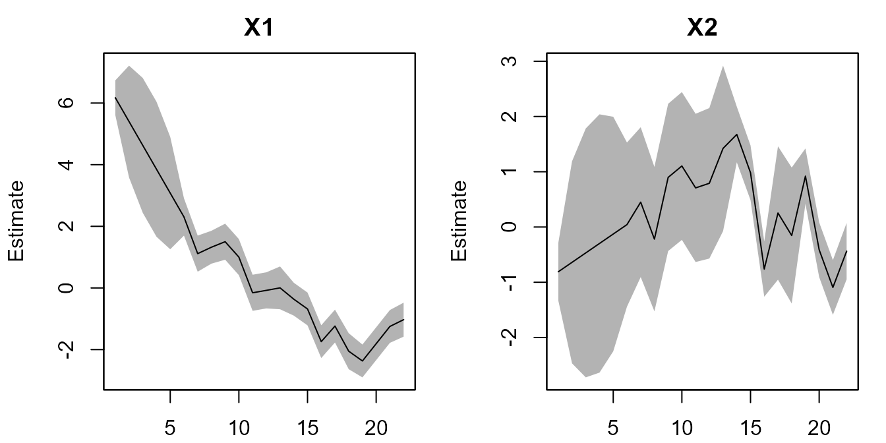
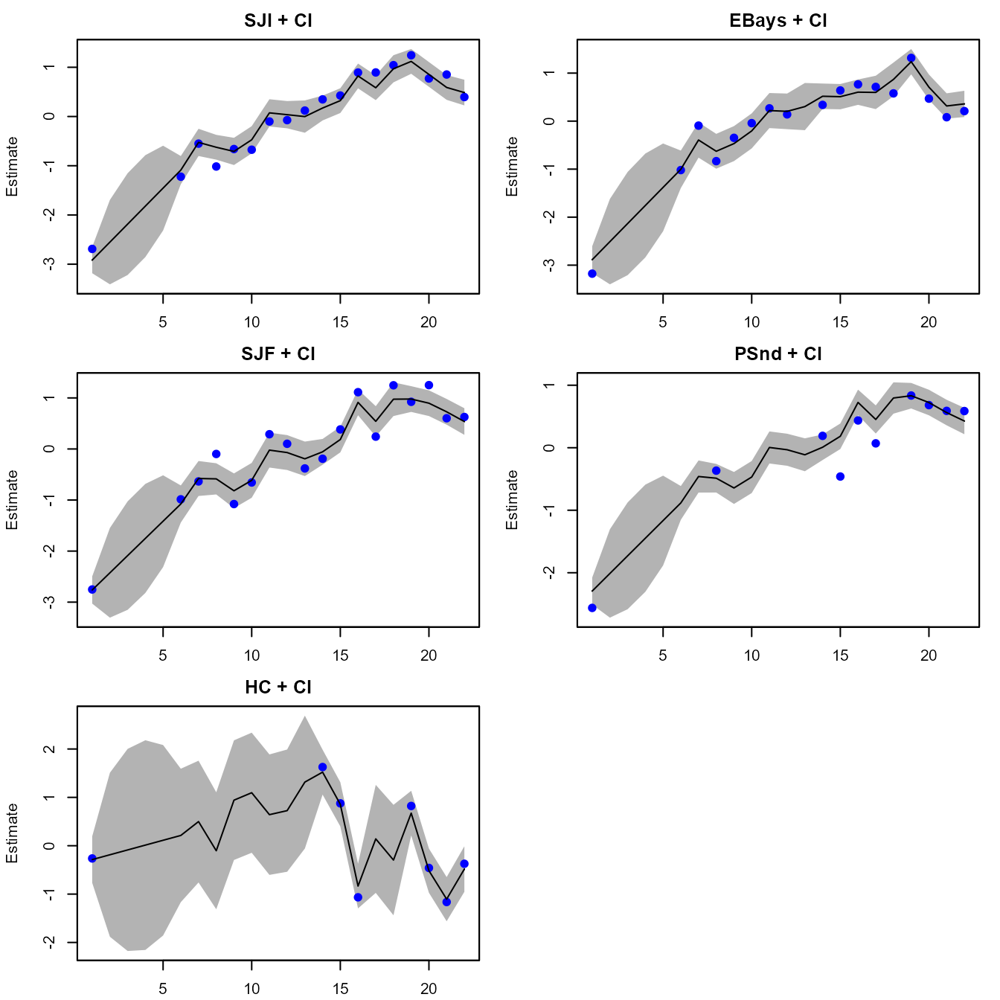
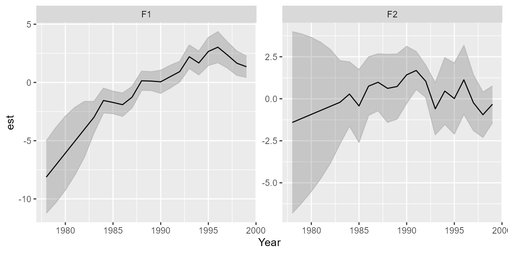
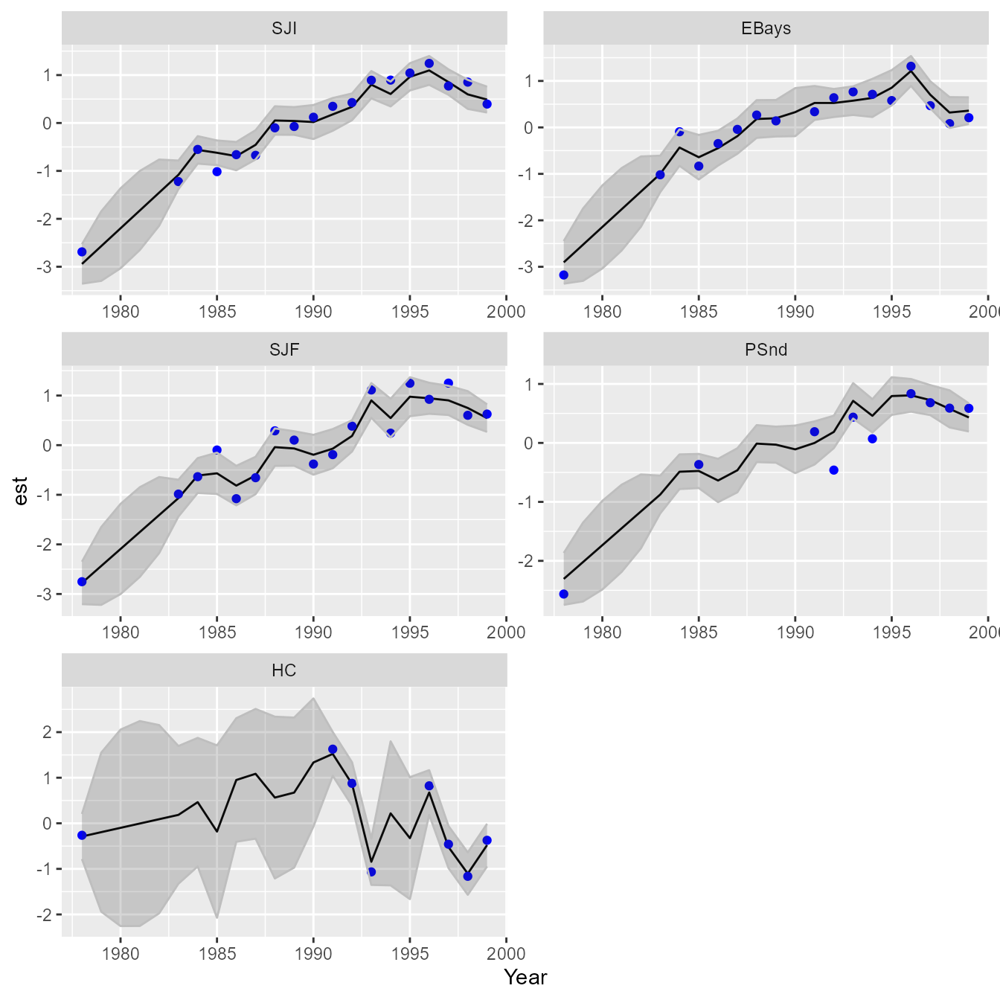
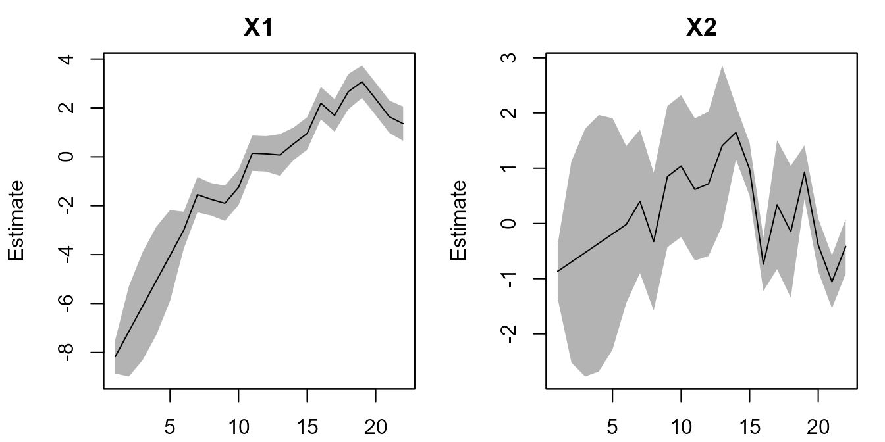

# Dynamic factor analysis

## Dynamic factor analysis

`dsem` is an R package for fitting dynamic structural equation models
(DSEMs) with a simple user-interface and generic specification of
simultaneous and lagged effects in a potentially recursive structure.
Here, we highlight how DSEM can be used to implement dynamic factor
analysis (DFA). We specifically replicate analysis using the
Multivariate Autoregressive State-Space (MARSS) package (Holmes, Ward,
and Wills 2012), using data that are provided as an example in the MARSS
package.

``` r
library(dsem)
#> Warning: package 'dsem' was built under R version 4.5.2
library(MARSS)
library(ggplot2)
#> Warning: package 'ggplot2' was built under R version 4.5.2
data( harborSealWA, package="MARSS")

# Define helper function
grab = \(x,name) x[which(names(x)==name)] 

# Define number of factors
# n_factors >= 3 doesn't seem to converge using DSEM or MARSS without penalties
n_factors = 2 

# set seed for vignette stability (factor models are a bit unstable)
set.seed(123)
```

## Using MARSS

We first illustrate a DFA model using two factors, fitted using MARSS:

``` r
# Load data
dat <- t(scale(harborSealWA[,c("SJI","EBays","SJF","PSnd","HC")]))

# DFA with 3 states; used BFGS because it fits much faster for this model
fit_MARSS <- MARSS( dat, 
                    model = list(m=n_factors),
                    form="dfa",
                    method="BFGS",
                    silent = TRUE )
```

We can then plot the estimated factors (latent variables):

``` r
# Plots states using all data
plot(fit_MARSS, plot.type="xtT")
```



    #> plot type = xtT Estimated states

And the estimated predictor for measurements (manifest variables):

``` r
# Plot expectation for data using all data
plot(fit_MARSS, plot.type="fitted.ytT")
```



    #> plot type =  fitted.ytT  Observations with fitted values

We also define a custom function to plot states:

``` r
plot_states = function( out,
                        vars=1:ncol(out$tmb_inputs$data$y_tj) ){
  # 
  xhat_tj = as.list(out$sdrep,report=TRUE,what="Estimate")$z_tj[,vars,drop=FALSE]
  xse_tj = as.list(out$sdrep,report=TRUE,what="Std. Error")$z_tj[,vars,drop=FALSE]

  # 
  longform = expand.grid( Year=time(tsdata), Var=colnames(tsdata)[vars] )
  longform$est = as.vector(xhat_tj)
  longform$se = as.vector(xse_tj)
  longform$upper = longform$est + 1.96*longform$se
  longform$lower = longform$est - 1.96*longform$se
  longform$data = as.vector(tsdata[,vars,drop=FALSE])
  
  # 
  ggplot(data=longform) +  #, aes(x=interaction(var,eq), y=Estimate, color=method)) +
    geom_line( aes(x=Year,y=est) ) +
    geom_point( aes(x=Year,y=data), color="blue", na.rm=TRUE ) +
    geom_ribbon( aes(ymax=as.numeric(upper),ymin=as.numeric(lower), x=Year), color="grey", alpha=0.2 ) + 
    facet_wrap( facets=vars(Var), scales="free", ncol=2 )
}
```

## Full-rank covariance using DSEM

In DSEM syntax, we can first fit a saturated (full-covariance) model
using the argument `covs`. However, we do not do so here to avoid bloat
in the vignettes:

``` r
# Add factors to data
tsdata = ts( cbind(harborSealWA[,c("SJI","EBays","SJF","PSnd","HC")]), start=1978)

# Scale and center (matches with MARSS does when fitting a DFA)
tsdata = scale( tsdata, center=TRUE, scale=TRUE )

# Define SEM
sem = "
  # Random-walk process for variables 
  SJF -> SJF, 1, NA, 1
  SJI -> SJI, 1, NA, 1
  EBays -> EBays, 1, NA, 1
  PSnd -> PSnd, 1, NA, 1
  HC -> HC, 1, NA, 1
"

# Initial fit
mydsem0 = dsem( 
  tsdata = tsdata,
  covs = c("SJF, SJI, EBays, PSnd, HC"),
  sem = sem,
  family = rep("normal", 5),
  control = dsem_control( 
    run_model = FALSE, 
    quiet = TRUE
  ) 
)   

# fix all measurement errors at diagonal and equal
map = mydsem0$tmb_inputs$map
map$lnsigma_j = factor( rep(1,ncol(tsdata)) )

#
mydsem_full = dsem( 
  tsdata = tsdata,
  covs = c("SJF, SJI, EBays, PSnd, HC"),
  sem = sem,
  family = rep("normal", 5),
  control = dsem_control( 
    quiet = TRUE,
    map = map  
  )
)

#
plot_states( mydsem_full )
```

## Reduced-rank factor model with measurement errors

Next, we can specify two factors factors while eliminating additional
process error and estimating measurement errors. This requires us to
switch to `gmrf_parameterization = "projection"`, so that we can fit a
rank-deficient Gaussian Markov random field:

``` r
# Add factors to data
tsdata = harborSealWA[,c("SJI","EBays","SJF","PSnd","HC")]
newcols = array( NA,
                 dim = c(nrow(tsdata),n_factors),
                 dimnames = list(NULL,paste0("F",seq_len(n_factors))) )
tsdata = ts( cbind(tsdata, newcols), start=1978)

# Scale and center (matches with MARSS does when fitting a DFA)
tsdata = scale( tsdata, center=TRUE, scale=TRUE )

# Automated version
#sem = make_dfa( variables = c("SJI","EBays","SJF","PSnd","HC"),
#                n_factors = n_factors )
# Manual specification to show structure, using equations-and-lags interface
equations = "
  # Loadings of variables onto factors
  SJI = L11(0.1) * F1
  EBays = L12(0.1) * F1 + L22(0.1) * F2
  SJF = L13(0.1) * F1 + L23(0.1) * F2
  PSnd = L14(0.1) * F1 + L24(0.1) * F2
  HC = L15(0.1) * F1 + L25(0.1) * F2

  # random walk for factors
  F1 = NA(1) * lag[F1,1]
  F2 = NA(1) * lag[F2,1]

  # Unit variance for factors
  V(F1) = NA(1)
  V(F2) = NA(1)

  # Zero residual variance for variables
  V(SJI) = NA(0)
  V(EBays) = NA(0)
  V(SJF) = NA(0)
  V(PSnd) = NA(0)
  V(HC) = NA(0)
"
sem = convert_equations(equations)

# Initial fit
mydsem0 = dsem( tsdata = tsdata,
               sem = sem,
               family = c( rep("normal",5), rep("fixed",n_factors) ),
               estimate_delta0 = TRUE,
               control = dsem_control( quiet = TRUE,
                                       run_model = FALSE,
                                       gmrf_parameterization = "projection" ) )

# fix all measurement errors at diagonal and equal
map = mydsem0$tmb_inputs$map
map$lnsigma_j = factor( rep(1,ncol(tsdata)) )

# Fix factors to have initial value, and variables to not
map$delta0_j = factor( c(rep(NA,ncol(harborSealWA)-1), 1:n_factors) )

# Fix variables to have no stationary mean except what's predicted by initial value
map$mu_j = factor( rep(NA,ncol(tsdata)) )

# profile "delta0_j" to match MARSS (which treats initial condition as unpenalized random effect)
mydfa = dsem( tsdata = tsdata,
               sem = sem,
               family = c( rep("normal",5), rep("fixed",n_factors) ),
               estimate_delta0 = TRUE,
               control = dsem_control( quiet = TRUE,
                                       map = map,
                                       use_REML = TRUE,
                                       #profile = "delta0_j",
                                       gmrf_parameterization = "projection" ) )
```

We again plot the estimated latent variables

``` r
# Plot estimated factors
plot_states( mydfa, vars=5+seq_len(n_factors) )
```



and the estimated predictor for manifest variables

``` r
# Plot estimated variables
plot_states( mydfa, vars=1:5 )
```



This results in similar (but not identical) factor values using MARSS
and DSEM. In particular, DSEM has higher variance in early years. This
likely arises because the default MARSS implementation of DFA includes a
penalty of the initial state $`\mathbf{x}_0`$ with mean zero and
variance of $`5\mathbf{I}`$. This term presumably provides additional
information about the initial year such that MARSS DFA results are not
invariant to reversing the order of the data.

To further explore, we can modify the MARSS DFA to eliminate the prior
on initial conditions, based on help from Dr. Eli Holmes. This involves
specifying:

``` r
# Extract internal settings
modmats <-  summary(fit_MARSS$model, silent=TRUE)
#> Model Structure is
#> m: 2 state process(es)
#> n: 5 observation time series

# Redefine defaults
modmats$V0 <- matrix(0, n_factors, n_factors )
modmats$x0 <- "unequal" 

# Refit
fit_MARSS2 = MARSS( dat, 
                    model = modmats,
                    silent = TRUE,
                    control = list( abstol = 0.001,
                                    conv.test.slope.tol = 0.01, 
                                    maxit = 1000 ))
```

These have estimated time-series that are more similar to those from
DSEM

``` r
# Plots states using all data
plot(fit_MARSS2, plot.type="xtT")
```



    #> plot type = xtT Estimated states

We can now compare the three options in terms of the fitted
log-likelihood:

``` r
# Compare likelihood for MARSS and DSEM
Table = c( "MARSS" = logLik(fit_MARSS), 
           "DSEM" = logLik(mydfa), 
           "MARSS_no_pen" = logLik(fit_MARSS2) )
knitr::kable( Table, digits=3)       
```

|              |       x |
|:-------------|--------:|
| MARSS        | -45.924 |
| DSEM         | -40.006 |
| MARSS_no_pen | -40.026 |

which confirms that the MARSS model without a penalty on initial
conditions results in the same likelihood as DSEM. Finally, we can also
compare the three options in terms of estimated loadings:

``` r
Table = cbind( "MARSS" = as.vector(fit_MARSS$par$Z),
       "DSEM" = grab(mydfa$opt$par,"beta_z"),
       "MARSS_no_pen" = as.vector(fit_MARSS2$par$Z) )
rownames(Table) = names(fit_MARSS$coef)[1:nrow(Table)]
knitr::kable( Table, digits=3)       
```

|      |  MARSS |   DSEM | MARSS_no_pen |
|:-----|-------:|-------:|-------------:|
| Z.11 | -0.473 |  0.362 |        0.360 |
| Z.21 | -0.440 |  0.320 |        0.332 |
| Z.31 | -0.465 |  0.218 |        0.356 |
| Z.41 | -0.382 |  0.368 |        0.292 |
| Z.51 |  0.075 | -0.150 |       -0.065 |
| Z.22 |  0.213 |  0.299 |        0.213 |
| Z.32 | -0.134 | -0.088 |       -0.157 |
| Z.42 | -0.079 | -0.128 |       -0.095 |
| Z.52 |  0.924 |  0.941 |        0.944 |

The estimating loadings are similar using DSEM and the MARSS model
without initial penalty, except with label switching (where some factors
and loadings can be multiplied by -1 with no change in the model):

Holmes, Elizabeth E., Eric J. Ward, and Kellie Wills. 2012. “Marss:
Multivariate Autoregressive State-Space Models for Analyzing Time-Series
Data.” *The R Journal* 4: 11–19.
<http://journal.r-project.org/archive/2012-1/RJournal_2012-1.pdf#page=11>.
