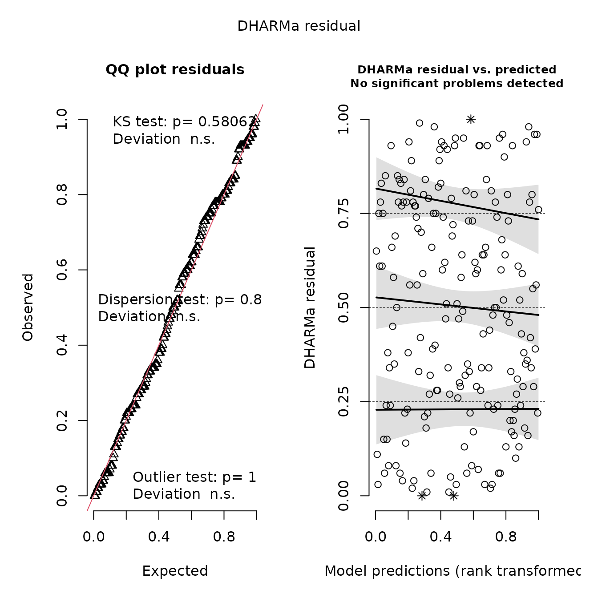
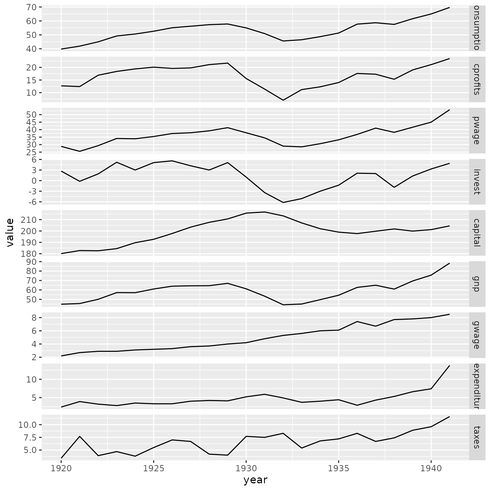
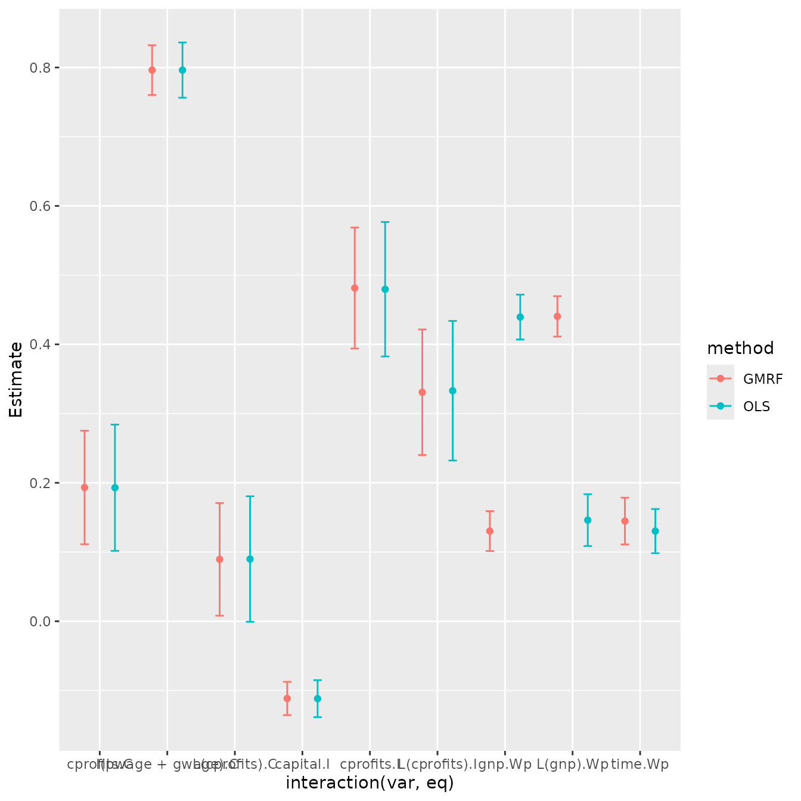
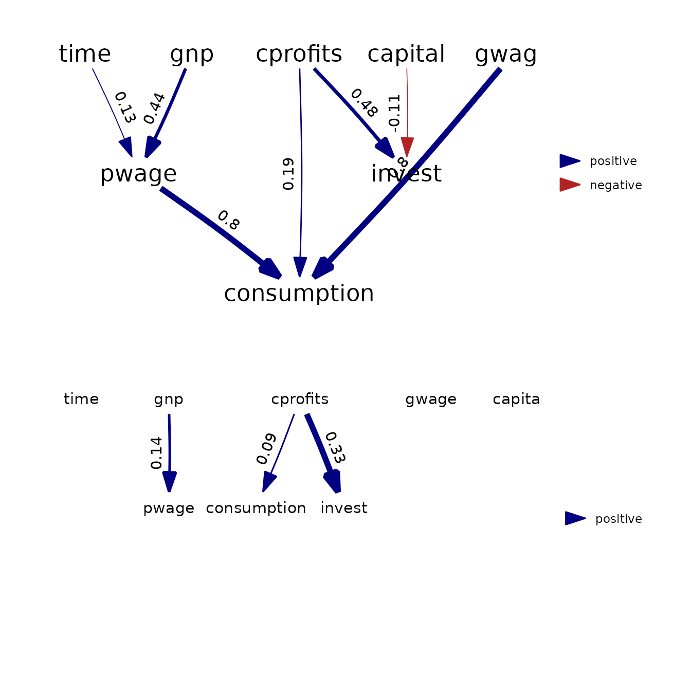
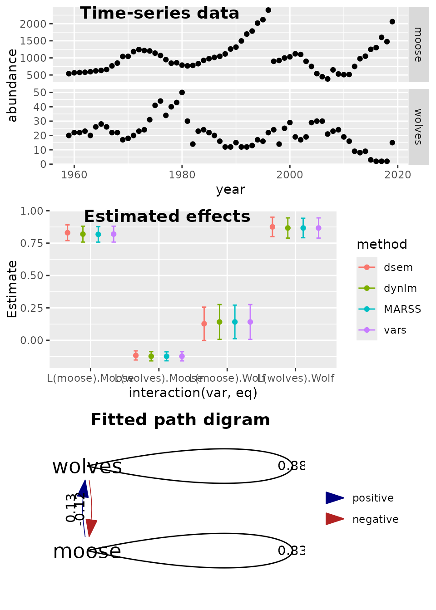
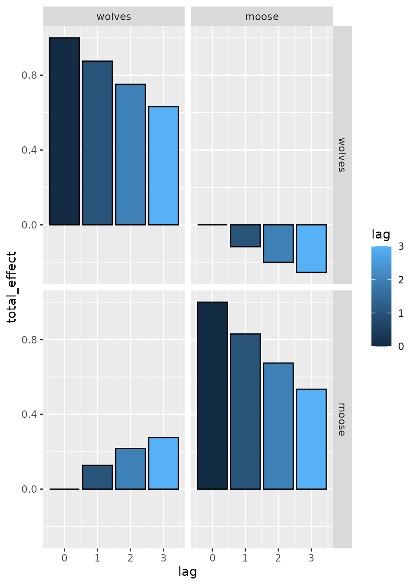
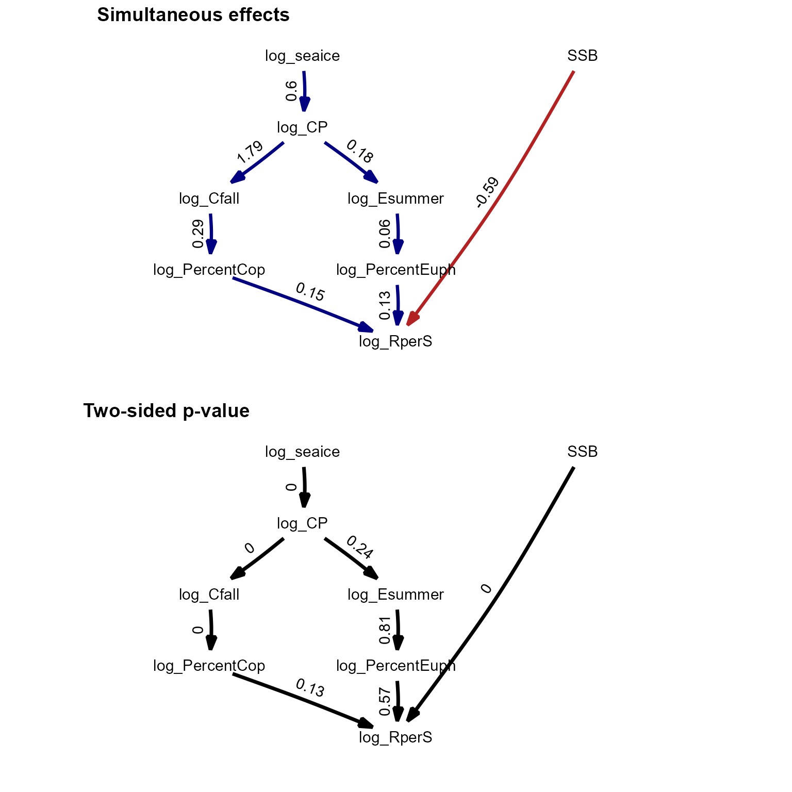
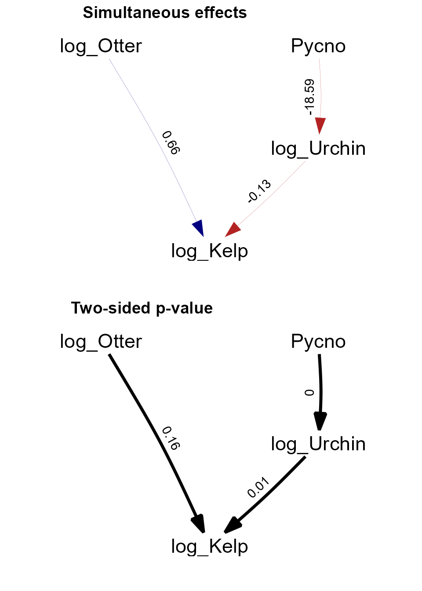
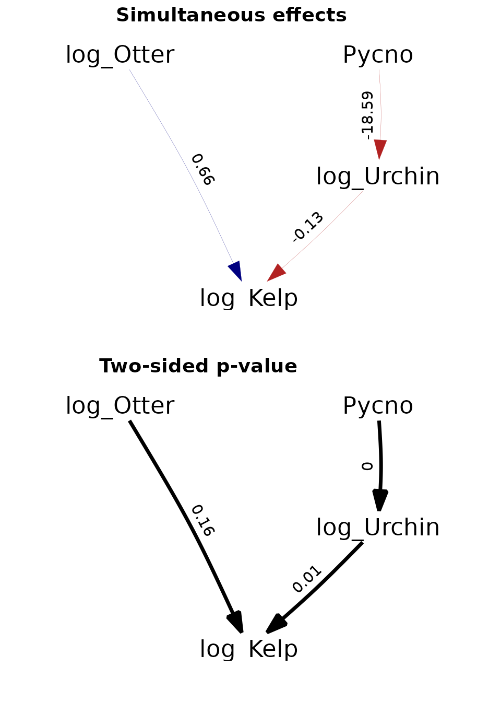

# Demonstration of selected features

``` r

library(dsem)
library(dynlm)
library(ggplot2)
library(reshape)
library(gridExtra)
library(phylopath)
```

`dsem` is an R package for fitting dynamic structural equation models
(DSEMs) with a simple user-interface and generic specification of
simultaneous and lagged effects in a non-recursive structure (Thorson et
al. 2024). We here highlight a few features in particular.

### Comparison with linear models

We first show that `dsem` can be specified such that it collapses to a
standard linear model. To do so, we simulate data with a single response
and single predictor:

``` r

# simulate normal distribution
x = rnorm(100)
y = 1 + 0.5 * x + rnorm(100)
data = data.frame(x=x, y=y)

# Fit as linear model
Lm = lm( y ~ x, data=data )

# Fit as DSEM
fit = dsem( 
  sem = "x -> y, 0, beta",
  tsdata = ts(data),
  control = dsem_control(quiet=TRUE) 
)

# Display output
m1 = rbind(
  "lm" = summary(Lm)$coef[2,1:2],
  "dsem" = summary(fit)[1,9:10]
)
knitr::kable( m1, digits=3)
```

|      | Estimate | Std_Error |
|:-----|---------:|----------:|
| lm   |    0.616 |     0.108 |
| dsem |    0.616 |     0.107 |

This shows that linear and dynamic structural equation models give
identical estimates of the single path coefficient.

We can also calculate leave-one-out residuals and display them using
DHARMa:

``` r

# sample-based quantile residuals
samples = loo_residuals(fit, what="samples", track_progress=FALSE)
which_use = which(!is.na(data))
fitResp = loo_residuals( fit, what="loo", track_progress=FALSE)[,'est']
simResp = apply(samples, MARGIN=3, FUN=as.vector)[which_use,]

# Build and display DHARMa object
res = DHARMa::createDHARMa(
  simulatedResponse = simResp,
  observedResponse = unlist(data)[which_use],
  fittedPredictedResponse = fitResp )
plot(res)
```



This shows no pattern in the quantile-quantile plot, as expected given
that we have a correctly specified model. We can also confirm that this
gives identical to results to the linear model:

``` r

# Get DSEM Loo residuals and LM working residuals
res = loo_residuals(fit, what="quantiles", track_progress=FALSE)
res0 = resid(Lm,"working")

# Plot comparison
plot( x=res0, y=qnorm(res[,2]),
      xlab="linear model residuals", ylab="dsem residuals" )
abline(a=0,b=1)
```


### Comparison with generalized linear models

Next, we show that DSEM can be specified to collapse to a standard
generalized linear model. However, this requires first understanding a
bit more about how DSEM treats both measurement and process errors.

In particular, DSEM is capable of fitting a state-space model that
incorporates two types of errors:

1.  Process errors, i.e., exogenous variation in a variable, beyond was
    is explained by covariates (paths from other variables);
2.  Measurement errors, i.e., variation in a measurement that follows a
    specified distribution (e.g., Gaussian, Poisson, etc.), where the
    variance of measurement errors is then typically estimated;

However, DSEM can then collapse this state-space model to:

- Measurement error model, by turning off process errors. This is done
  by fixing the exogenous variation for a given variable at zero (e.g.,
  `X <-> X, 0, NA, 0` fixes the exogenous variation for variable X at
  zero);
- Process-error model, by turning off measurement errors by using
  `family = "fixed"`).

A generalized linear mixed model is then equivalent to a state-space
model where:

- covariates have no measurement errors;
- the response has no process errors, such that residuals are attributed
  purely to measurement errors.

We show this equivalence by simulating counts from a log-linked Poisson
GLM, and fitting it using `dsem` and `glm`

``` r

# Simulate a log-linked Poisson GLM
x = rnorm(100)
p = 1 + 0.8 * x
y = rpois( length(x), lambda = exp(p) )
data = data.frame(x=x, y=y)

# Fit as generalized linear model
Glm = glm( y ~ x, data=data, family = poisson() )

# Define zero process errors (only process errors) in response y
sem = "
  x -> y, 0, beta
  y <-> y, 0, NA, 0
"

# Fit as DSEM
fit = dsem( 
  sem = sem,
  tsdata = ts(data),
  family = c("fixed","poisson"),
  control = dsem_control(quiet=TRUE) 
)

# Display output
m1 = rbind(
  "glm" = summary(Glm)$coef[2,1:2],
  "dsem" = summary(fit)[1,9:10]
)
knitr::kable( m1, digits=3)
```

|      | Estimate | Std_Error |
|:-----|---------:|----------:|
| glm  |    0.715 |     0.051 |
| dsem |    0.715 |     0.051 |

We note that this model combines zero-measurement errors for predictor
`x` with zero-process errors for response `y`. This combination requires
`dsem` version 2.0.0 or later, using the new default option
`dsem_control( gmrf_parameterization = "gmrf_project")`. In this GLM
example, `gmrf_parameterization = "gmrf_project"` first calculates a
full-rank GMRF for covariate `x` and then projects it to response `y`
using a conditional prediction that has reduced rank. Detecting
full-rank vs. reduced-rank then occurs “behind the scenes”; this option
should be fast while allowing many combinations of turned-off process
and measurement errors, but remains somewhat experimental.

### Comparison with dynamic linear models

We next demonstrate `dsem` using a well-known econometric model, the
Klein-1 model.

``` r

data(KleinI, package="AER")
TS = ts(data.frame(KleinI, "time"=time(KleinI) - 1931))

# Specify by declaring each arrow and lag
sem = "
  # Link, lag, param_name
  cprofits -> consumption, 0, a1
  cprofits -> consumption, 1, a2
  pwage -> consumption, 0, a3
  gwage -> consumption, 0, a3

  cprofits -> invest, 0, b1
  cprofits -> invest, 1, b2
  capital -> invest, 0, b3

  gnp -> pwage, 0, c2
  gnp -> pwage, 1, c3
  time -> pwage, 0, c1
"
tsdata = TS[,c("time","gnp","pwage","cprofits",'consumption',
               "gwage","invest","capital")]
fit = dsem( 
  sem = sem,
  tsdata = tsdata,
  estimate_delta0 = TRUE,
  control = dsem_control(
    quiet = TRUE,
    newton_loops = 0
  ) 
)
```

This model could instead be specified using equation-and-lag notation,
which makes the model structure more clear:

``` r

# Specify using equations
equations = "
  consumption = a1*cprofits + a2*lag[cprofits,1]+ a3*pwage + a3*gwage
  invest = b1*cprofits + b2*lag[cprofits,1] + b3*capital
  pwage = c1*time + c2*gnp + c3*lag[gnp,1]
"

# Convert and run
sem_equations = convert_equations(equations)
fit = dsem( 
  sem = sem_equations,
  tsdata = tsdata,
  estimate_delta0 = TRUE,
  control = dsem_control(
    quiet = TRUE,
    newton_loops = 0
  ) 
)
```

We first demonstrate that `dsem` gives identical results to `dynlm`:

``` r

# dynlm
fm_cons <- dynlm(consumption ~ cprofits + L(cprofits) + I(pwage + gwage), data = TS)
fm_inv <- dynlm(invest ~ cprofits + L(cprofits) + capital, data = TS)
fm_pwage <- dynlm(pwage ~ gnp + L(gnp) + time, data = TS)

# Compile results
m1 = rbind( summary(fm_cons)$coef[-1,],
            summary(fm_inv)$coef[-1,],
            summary(fm_pwage)$coef[-1,] )[,1:2]
m2 = summary(fit$sdrep)[1:9,]
m = rbind(
  data.frame("var"=rownames(m1),m1,"method"="OLS","eq"=rep(c("C","I","Wp"),each=3)),
  data.frame("var"=rownames(m1),m2,"method"="GMRF","eq"=rep(c("C","I","Wp"),each=3))
)
m = cbind(m, "lower"=m$Estimate-m$Std..Error, "upper"=m$Estimate+m$Std..Error )

# ggplot display of estimates
longform = melt( as.data.frame(KleinI) )
  longform$year = rep( time(KleinI), 9 )
p1 = ggplot( data=longform, aes(x=year, y=value) ) +
  facet_grid( rows=vars(variable), scales="free" ) +
  geom_line( )

p2 = ggplot(data=m, aes(x=interaction(var,eq), y=Estimate, color=method)) +
  geom_point( position=position_dodge(0.9) ) +
  geom_errorbar( aes(ymax=as.numeric(upper),ymin=as.numeric(lower)),
                 width=0.25, position=position_dodge(0.9))  #

p3 = plot( as_fitted_DAG(fit) ) +
     expand_limits(x = c(-0.2,1) )
p4 = plot( as_fitted_DAG(fit, lag=1), text_size=4 ) +
     expand_limits(x = c(-0.2,1), y = c(-0.2,0) )

p1
```



``` r

p2
```



``` r

grid.arrange( arrangeGrob(p3, p4, nrow=2) )
```



Results show that both packages provide (almost) identical estimates and
standard errors.

We can also compare results using the Laplace approximation against
those obtained via numerical integration of random effects using MCMC.
In this example, MCMC results in somewhat higher estimates of exogenous
variance parameters (presumably because those follow a chi-squared
distribution with positive skewness), but otherwise the two produce
similar estimates.

``` r

library(tmbstan)

# MCMC for both fixed and random effects
mcmc = tmbstan( fit$obj, init="last.par.best" )
summary_mcmc = summary(mcmc)
```

``` r

# long-form data frame
m1 = summary_mcmc$summary[1:17,c('mean','sd')]
rownames(m1) = paste0( "b", seq_len(nrow(m1)) )
m2 = summary(fit$sdrep)[1:17,c('Estimate','Std. Error')]
m = rbind(
  data.frame('mean'=m1[,1], 'sd'=m1[,2], 'par'=rownames(m1), "method"="MCMC"),
  data.frame('mean'=m2[,1], 'sd'=m2[,2], 'par'=rownames(m1), "method"="LA")
)
m$lower = m$mean - m$sd
m$upper = m$mean + m$sd

# plot
ggplot(data=m, aes(x=par, y=mean, col=method)) +
  geom_point( position=position_dodge(0.9) ) +
  geom_errorbar( aes(ymax=as.numeric(upper),ymin=as.numeric(lower)),
                 width=0.25, position=position_dodge(0.9))  #
```



### Comparison with vector autoregressive models

We next demonstrate that `dsem` gives similar results to a vector
autoregressive (VAR) model. To do so, we analyze population abundance of
wolf and moose populations on Isle Royale from 1959 to 2019, downloaded
from their website (Vucetich and Peterson 2012) (URL:
www.isleroyalewolf.org).

This dataset was previously analyzed by in Chapter 14 of the User Manual
for the R-package MARSS (Holmes et al. 2012).

Here, we compare fits using `dsem` with `dynlm`, as well as a vector
autoregressive model package `vars`, and finally with `MARSS`.

``` r

data(isle_royale)
data = ts( log(isle_royale[,2:3]), start=1959)

sem = "
  # Link, lag, param_name
  wolves -> wolves, 1, arW
  moose -> wolves, 1, MtoW
  wolves -> moose, 1, WtoM
  moose -> moose, 1, arM
"
# initial first without delta0 (to improve starting values)
fit0 = dsem( 
  sem = sem,
  tsdata = data,
  estimate_delta0 = FALSE,
  control = dsem_control(
    quiet = FALSE,
    getsd = FALSE
  ) 
)
#>   Coefficient_name Number_of_coefficients   Type
#> 1           beta_z                      6  Fixed
#> 2             mu_j                      2 Random

#
parameters = fit0$obj$env$parList()
  parameters$delta0_j = rep( 0, ncol(data) )

# Refit with delta0
fit = dsem( 
  sem = sem,
  tsdata = data,
  estimate_delta0 = TRUE,
  control = dsem_control( 
    quiet=TRUE,
    parameters = parameters 
  ) 
)

# dynlm
fm_wolf = dynlm( wolves ~ 1 + L(wolves) + L(moose), data=data )   #
fm_moose = dynlm( moose ~ 1 + L(wolves) + L(moose), data=data )   #

# MARSS
library(MARSS)
z.royale.dat <- t(scale(data.frame(data),center=TRUE,scale=FALSE))
royale.model.1 <- list(
  Z = "identity",
  B = "unconstrained",
  Q = "diagonal and unequal",
  R = "zero",
  U = "zero"
)
kem.1 <- MARSS(z.royale.dat, model = royale.model.1)
#> Success! algorithm run for 15 iterations. abstol and log-log tests passed.
#> Alert: conv.test.slope.tol is 0.5.
#> Test with smaller values (<0.1) to ensure convergence.
#> 
#> MARSS fit is
#> Estimation method: kem 
#> Convergence test: conv.test.slope.tol = 0.5, abstol = 0.001
#> Algorithm ran 15 (=minit) iterations and convergence was reached. 
#> Log-likelihood: -3.21765 
#> AIC: 22.4353   AICc: 23.70964   
#>  
#>                       Estimate
#> B.(1,1)                 0.8669
#> B.(2,1)                -0.1240
#> B.(1,2)                 0.1417
#> B.(2,2)                 0.8176
#> Q.(X.wolves,X.wolves)   0.1341
#> Q.(X.moose,X.moose)     0.0284
#> x0.X.wolves             0.2324
#> x0.X.moose             -0.6476
#> Initial states (x0) defined at t=0
#> 
#> Standard errors have not been calculated. 
#> Use MARSSparamCIs to compute CIs and bias estimates.
SE <- MARSSparamCIs( kem.1 )

# Using VAR package
library(vars)
var = VAR( data, type="const" )

### Compile
m1 = rbind( summary(fm_wolf)$coef[-1,], summary(fm_moose)$coef[-1,] )[,1:2]
m2 = summary(fit$sdrep)[1:4,]
#m2 = cbind( "Estimate"=fit$opt$par, "Std. Error"=fit$sdrep$par.fixed )[1:4,]
m3 = cbind( SE$parMean[c(1,3,2,4)], SE$par.se$B[c(1,3,2,4)] )
colnames(m3) = colnames(m2)
m4 = rbind( summary(var$varresult$wolves)$coef[-3,], summary(var$varresult$moose)$coef[-3,] )[,1:2]

# Bundle
m = rbind(
  data.frame("var"=rownames(m1), m1, "method"="dynlm", "eq"=rep(c("Wolf","Moose"),each=2)),
  data.frame("var"=rownames(m1), m2, "method"="dsem", "eq"=rep(c("Wolf","Moose"),each=2)),
  data.frame("var"=rownames(m1), m3, "method"="MARSS", "eq"=rep(c("Wolf","Moose"),each=2)),
  data.frame("var"=rownames(m1), m4, "method"="vars", "eq"=rep(c("Wolf","Moose"),each=2))
)
#knitr::kable( m1, digits=3)
#knitr::kable( m2, digits=3)

m = cbind(m, "lower"=m$Estimate-m$Std..Error, "upper"=m$Estimate+m$Std..Error )

# ggplot estimates ... interaction(x,y) causes an error sometimes
library(ggplot2)
library(ggpubr)
library(ggraph)
longform = reshape( isle_royale, idvar = "year", direction="long", varying=list(2:3), v.names="abundance", timevar="species", times=c("wolves","moose") )
p1 = ggplot( data=longform, aes(x=year, y=abundance) ) +
  facet_grid( rows=vars(species), scales="free" ) +
  geom_point( )

p2 = ggplot(data=m, aes(x=interaction(var,eq), y=Estimate, color=method)) +
  geom_point( position=position_dodge(0.9) ) +
  geom_errorbar( aes(ymax=as.numeric(upper),ymin=as.numeric(lower)),
                 width=0.25, position=position_dodge(0.9))  #
p3 = plot( as_fitted_DAG(fit, lag=1), rotation=0 ) +
     geom_edge_loop( aes( label=round(weight,2), direction=0)) + #arrow=arrow(), , angle_calc="along", label_dodge=grid::unit(10,"points") )
     expand_limits(x = c(-0.1,0) )

ggarrange( p1, p2, p3,
           labels = c("Time-series data", "Estimated effects", "Fitted path digram"),
           ncol = 1, nrow = 3)
```


We can then plot the total effects, which shows that effects propagate
through time due to both interactions and density dependence:

``` r

# Calculate total effects
effect = total_effect( fit )

# Plot total effect
ggplot( effect) + 
  geom_bar( aes(lag, total_effect, fill=lag), stat='identity', col='black', position='dodge' ) +
  facet_grid( from ~ to  )
```



Results again show that `dsem` can estimate parameters for a vector
autoregressive model (VAM), and it exactly matches results from `vars`,
using `dynlm`, or using `MARSS`.

### Multi-causal ecosystem synthesis

We next replicate an analysis involving climate, forage fishes, stomach
contents, and recruitment of a predatory fish.

``` r

data(bering_sea)
Z = ts( bering_sea )
family = rep('fixed', ncol(bering_sea))

# Specify model
sem = "
  # Link, lag, param_name
  log_seaice -> log_CP, 0, seaice_to_CP
  log_CP -> log_Cfall, 0, CP_to_Cfall
  log_CP -> log_Esummer, 0, CP_to_E
  log_PercentEuph -> log_RperS, 0, Seuph_to_RperS
  log_PercentCop -> log_RperS, 0, Scop_to_RperS
  log_Esummer -> log_PercentEuph, 0, Esummer_to_Suph
  log_Cfall -> log_PercentCop, 0, Cfall_to_Scop
  SSB -> log_RperS, 0, SSB_to_RperS

  log_seaice -> log_seaice, 1, AR1, 0.001
  log_CP -> log_CP, 1,  AR2, 0.001
  log_Cfall -> log_Cfall, 1, AR4, 0.001
  log_Esummer -> log_Esummer, 1, AR5, 0.001
  SSB -> SSB, 1, AR6, 0.001
  log_RperS ->  log_RperS, 1, AR7, 0.001
  log_PercentEuph -> log_PercentEuph, 1, AR8, 0.001
  log_PercentCop -> log_PercentCop, 1, AR9, 0.001
"

# Fit
fit = dsem( 
  sem = sem,
  tsdata = Z,
  family = family,
  control = dsem_control(
    use_REML=FALSE, 
    quiet=TRUE
  ) 
)
ParHat = fit$obj$env$parList()
# summary( fit )
```

``` r

# Timeseries plot
oldpar <- par(no.readonly = TRUE)
par( mfcol=c(3,3), mar=c(2,2,2,0), mgp=c(2,0.5,0), tck=-0.02 )
for(i in 1:ncol(bering_sea)){
  tmp = bering_sea[,i,drop=FALSE]
  tmp = cbind( tmp, "pred"=ParHat$x_tj[,i] )
  SD = as.list(fit$sdrep,what="Std.")$x_tj[,i]
  tmp = cbind( tmp, "lower"=tmp[,2] - ifelse(is.na(SD),0,SD),
                    "upper"=tmp[,2] + ifelse(is.na(SD),0,SD) )
  #
  plot( x=rownames(bering_sea), y=tmp[,1], ylim=range(tmp,na.rm=TRUE),
        type="p", main=colnames(bering_sea)[i], pch=20, cex=2 )
  lines( x=rownames(bering_sea), y=tmp[,2], type="l", lwd=2,
         col="blue", lty="solid" )
  polygon( x=c(rownames(bering_sea),rev(rownames(bering_sea))),
           y=c(tmp[,3],rev(tmp[,4])), col=rgb(0,0,1,0.2), border=NA )
}
par(oldpar)
```



``` r

#
library(phylopath)
library(ggplot2)
library(ggpubr)
library(reshape)
library(gridExtra)
longform = melt( bering_sea )
  longform$year = rep( 1963:2023, ncol(bering_sea) )
p0 = ggplot( data=longform, aes(x=year, y=value) ) +
  facet_grid( rows=vars(variable), scales="free" ) +
  geom_point( )

p1 = plot( (as_fitted_DAG(fit)), edge.width=1, type="width",
           text_size=4, show.legend=FALSE,
           arrow = grid::arrow(type='closed', 18, grid::unit(10,'points')) ) +
     scale_x_continuous(expand = c(0.4, 0.1))
p1$layers[[1]]$mapping$edge_width = 1
p2 = plot( (as_fitted_DAG(fit, what="p_value")), edge.width=1, type="width",
           text_size=4, show.legend=FALSE, colors=c('black', 'black'),
           arrow = grid::arrow(type='closed', 18, grid::unit(10,'points')) ) +
     scale_x_continuous(expand = c(0.4, 0.1))
p2$layers[[1]]$mapping$edge_width = 0.5

#grid.arrange( arrangeGrob( p0+ggtitle("timeseries"),
#              arrangeGrob( p1+ggtitle("Estimated path diagram"),
#                           p2+ggtitle("Estimated p-values"), nrow=2), ncol=2 ) )
ggarrange(p1, p2, labels = c("Simultaneous effects", "Two-sided p-value"),
                    ncol = 1, nrow = 2)
```



These results are further discussed in the paper describing dsem.

### Site-replicated trophic cascade

Finally, we replicate an analysis involving a trophic cascade involving
sea stars predators, sea urchin consumers, and kelp producers.

``` r

data(sea_otter)
Z = ts( sea_otter[,-1] )

# Specify model
sem = "
  Pycno_CANNERY_DC -> log_Urchins_CANNERY_DC, 0, x2
  log_Urchins_CANNERY_DC -> log_Kelp_CANNERY_DC, 0, x3
  log_Otter_Count_CANNERY_DC -> log_Kelp_CANNERY_DC, 0, x4

  Pycno_CANNERY_UC -> log_Urchins_CANNERY_UC, 0, x2
  log_Urchins_CANNERY_UC -> log_Kelp_CANNERY_UC, 0, x3
  log_Otter_Count_CANNERY_UC -> log_Kelp_CANNERY_UC, 0, x4

  Pycno_HOPKINS_DC -> log_Urchins_HOPKINS_DC, 0, x2
  log_Urchins_HOPKINS_DC -> log_Kelp_HOPKINS_DC, 0, x3
  log_Otter_Count_HOPKINS_DC -> log_Kelp_HOPKINS_DC, 0, x4

  Pycno_HOPKINS_UC -> log_Urchins_HOPKINS_UC, 0, x2
  log_Urchins_HOPKINS_UC -> log_Kelp_HOPKINS_UC, 0, x3
  log_Otter_Count_HOPKINS_UC -> log_Kelp_HOPKINS_UC, 0, x4

  Pycno_LOVERS_DC -> log_Urchins_LOVERS_DC, 0, x2
  log_Urchins_LOVERS_DC -> log_Kelp_LOVERS_DC, 0, x3
  log_Otter_Count_LOVERS_DC -> log_Kelp_LOVERS_DC, 0, x4

  Pycno_LOVERS_UC -> log_Urchins_LOVERS_UC, 0, x2
  log_Urchins_LOVERS_UC -> log_Kelp_LOVERS_UC, 0, x3
  log_Otter_Count_LOVERS_UC -> log_Kelp_LOVERS_UC, 0, x4

  Pycno_MACABEE_DC -> log_Urchins_MACABEE_DC, 0, x2
  log_Urchins_MACABEE_DC -> log_Kelp_MACABEE_DC, 0, x3
  log_Otter_Count_MACABEE_DC -> log_Kelp_MACABEE_DC, 0, x4

  Pycno_MACABEE_UC -> log_Urchins_MACABEE_UC, 0, x2
  log_Urchins_MACABEE_UC -> log_Kelp_MACABEE_UC, 0, x3
  log_Otter_Count_MACABEE_UC -> log_Kelp_MACABEE_UC, 0, x4

  Pycno_OTTER_PT_DC -> log_Urchins_OTTER_PT_DC, 0, x2
  log_Urchins_OTTER_PT_DC -> log_Kelp_OTTER_PT_DC, 0, x3
  log_Otter_Count_OTTER_PT_DC -> log_Kelp_OTTER_PT_DC, 0, x4

  Pycno_OTTER_PT_UC -> log_Urchins_OTTER_PT_UC, 0, x2
  log_Urchins_OTTER_PT_UC -> log_Kelp_OTTER_PT_UC, 0, x3
  log_Otter_Count_OTTER_PT_UC -> log_Kelp_OTTER_PT_UC, 0, x4

  Pycno_PINOS_CEN -> log_Urchins_PINOS_CEN, 0, x2
  log_Urchins_PINOS_CEN -> log_Kelp_PINOS_CEN, 0, x3
  log_Otter_Count_PINOS_CEN -> log_Kelp_PINOS_CEN, 0, x4

  Pycno_SIREN_CEN -> log_Urchins_SIREN_CEN, 0, x2
  log_Urchins_SIREN_CEN -> log_Kelp_SIREN_CEN, 0, x3
  log_Otter_Count_SIREN_CEN -> log_Kelp_SIREN_CEN, 0, x4

  # AR1
  Pycno_CANNERY_DC -> Pycno_CANNERY_DC, 1, ar1
  log_Urchins_CANNERY_DC -> log_Urchins_CANNERY_DC, 1, ar2
  log_Otter_Count_CANNERY_DC -> log_Otter_Count_CANNERY_DC, 1, ar3
  log_Kelp_CANNERY_DC -> log_Kelp_CANNERY_DC, 1, ar4

  Pycno_CANNERY_UC -> Pycno_CANNERY_UC, 1, ar1
  log_Urchins_CANNERY_UC -> log_Urchins_CANNERY_UC, 1, ar2
  log_Otter_Count_CANNERY_UC -> log_Otter_Count_CANNERY_UC, 1, ar3
  log_Kelp_CANNERY_UC -> log_Kelp_CANNERY_UC, 1, ar4

  Pycno_HOPKINS_DC -> Pycno_HOPKINS_DC, 1, ar1
  log_Urchins_HOPKINS_DC -> log_Urchins_HOPKINS_DC, 1, ar2
  log_Otter_Count_HOPKINS_DC -> log_Otter_Count_HOPKINS_DC, 1, ar3
  log_Kelp_HOPKINS_DC -> log_Kelp_HOPKINS_DC, 1, ar4

  Pycno_HOPKINS_UC -> Pycno_HOPKINS_UC, 1, ar1
  log_Urchins_HOPKINS_UC -> log_Urchins_HOPKINS_UC, 1, ar2
  log_Otter_Count_HOPKINS_UC -> log_Otter_Count_HOPKINS_UC, 1, ar3
  log_Kelp_HOPKINS_UC -> log_Kelp_HOPKINS_UC, 1, ar4

  Pycno_LOVERS_DC -> Pycno_LOVERS_DC, 1, ar1
  log_Urchins_LOVERS_DC -> log_Urchins_LOVERS_DC, 1, ar2
  log_Otter_Count_LOVERS_DC -> log_Otter_Count_LOVERS_DC, 1, ar3
  log_Kelp_LOVERS_DC -> log_Kelp_LOVERS_DC, 1, ar4

  Pycno_LOVERS_UC -> Pycno_LOVERS_UC, 1, ar1
  log_Urchins_LOVERS_UC -> log_Urchins_LOVERS_UC, 1, ar2
  log_Otter_Count_LOVERS_UC -> log_Otter_Count_LOVERS_UC, 1, ar3
  log_Kelp_LOVERS_UC -> log_Kelp_LOVERS_UC, 1, ar4

  Pycno_MACABEE_DC -> Pycno_MACABEE_DC, 1, ar1
  log_Urchins_MACABEE_DC -> log_Urchins_MACABEE_DC, 1, ar2
  log_Otter_Count_MACABEE_DC -> log_Otter_Count_MACABEE_DC, 1, ar3
  log_Kelp_MACABEE_DC -> log_Kelp_MACABEE_DC, 1, ar4

  Pycno_MACABEE_UC -> Pycno_MACABEE_UC, 1, ar1
  log_Urchins_MACABEE_UC -> log_Urchins_MACABEE_UC, 1, ar2
  log_Otter_Count_MACABEE_UC -> log_Otter_Count_MACABEE_UC, 1, ar3
  log_Kelp_MACABEE_UC -> log_Kelp_MACABEE_UC, 1, ar4

  Pycno_OTTER_PT_DC -> Pycno_OTTER_PT_DC, 1, ar1
  log_Urchins_OTTER_PT_DC -> log_Urchins_OTTER_PT_DC, 1, ar2
  log_Otter_Count_OTTER_PT_DC -> log_Otter_Count_OTTER_PT_DC, 1, ar3
  log_Kelp_OTTER_PT_DC -> log_Kelp_OTTER_PT_DC, 1, ar4

  Pycno_OTTER_PT_UC -> Pycno_OTTER_PT_UC, 1, ar1
  log_Urchins_OTTER_PT_UC -> log_Urchins_OTTER_PT_UC, 1, ar2
  log_Otter_Count_OTTER_PT_UC -> log_Otter_Count_OTTER_PT_UC, 1, ar3
  log_Kelp_OTTER_PT_UC -> log_Kelp_OTTER_PT_UC, 1, ar4

  Pycno_PINOS_CEN -> Pycno_PINOS_CEN, 1, ar1
  log_Urchins_PINOS_CEN -> log_Urchins_PINOS_CEN, 1, ar2
  log_Otter_Count_PINOS_CEN -> log_Otter_Count_PINOS_CEN, 1, ar3
  log_Kelp_PINOS_CEN -> log_Kelp_PINOS_CEN, 1, ar4

  Pycno_SIREN_CEN -> Pycno_SIREN_CEN, 1, ar1
  log_Urchins_SIREN_CEN -> log_Urchins_SIREN_CEN, 1, ar2
  log_Otter_Count_SIREN_CEN -> log_Otter_Count_SIREN_CEN, 1, ar3
  log_Kelp_SIREN_CEN -> log_Kelp_SIREN_CEN, 1, ar4
"

# Fit model
fit = dsem( 
  sem = sem,
  tsdata = Z,
  control = dsem_control(
    use_REML=FALSE, 
    quiet=TRUE
  ) 
)

#
library(phylopath)
library(ggplot2)
library(ggpubr)
get_part = function(x){
  vars = c("log_Kelp","log_Otter","log_Urchin","Pycno")
  index = sapply( vars, FUN=\(y) grep(y,rownames(x$coef))[1] )
  x$coef = x$coef[index,index]
  dimnames(x$coef) = list( vars, vars )
  return(x)
}
p1 = plot( get_part(as_fitted_DAG(fit)), type="width", show.legend=FALSE)
p1$layers[[1]]$mapping$edge_width = 0.5
p2 = plot( get_part(as_fitted_DAG(fit, what="p_value" )), type="width",
           show.legend=FALSE, colors=c('black', 'black'))
p2$layers[[1]]$mapping$edge_width = 0.1

longform = melt( sea_otter[,-1], as.is=TRUE )
longform$X1 = 1999:2019[longform$X1]
longform$Site = gsub( "log_Kelp_", "",
                gsub( "log_Urchins_", "",
                gsub( "Pycno_", "",
                gsub( "log_Otter_Count_", "", longform$X2))))
longform$Species = sapply( seq_len(nrow(longform)), FUN=\(i)gsub(longform$Site[i],"",longform$X2[i]) )
p3 = ggplot( data=longform, aes(x=X1, y=value, col=Species) ) +
  facet_grid( rows=vars(Site), scales="free" ) +
  geom_line( )

ggarrange(p1 + scale_x_continuous(expand = c(0.3, 0)),
                    p2 + scale_x_continuous(expand = c(0.3, 0)),
                    labels = c("Simultaneous effects", "Two-sided p-value"),
                    ncol = 1, nrow = 2)
```



Again, these results are further discussed in the paper describing dsem.

Runtime for this vignette: 26.81 secs

## Works cited

Holmes, Elizabeth E., Eric J. Ward, and Kellie Wills. 2012. “MARSS:
Multivariate Autoregressive State-Space Models for Analyzing Time-Series
Data.” *The R Journal* 4 (1): 11–19.
<https://doi.org/10.32614/RJ-2012-002>.

Thorson, James T., Alexander G. Andrews III, Timothy E. Essington, and
Scott I. Large. 2024. “Dynamic Structural Equation Models Synthesize
Ecosystem Dynamics Constrained by Ecological Mechanisms.” *Methods in
Ecology and Evolution* 15 (4): 744–55.
<https://doi.org/10.1111/2041-210X.14289>.

Vucetich, John A., and R. O. Peterson. 2012. *The Population Biology of
Isle Royale Wolves and Moose: An Overview*.
[www.isleroyalewolf.org](https://www.isleroyalewolf.org).
