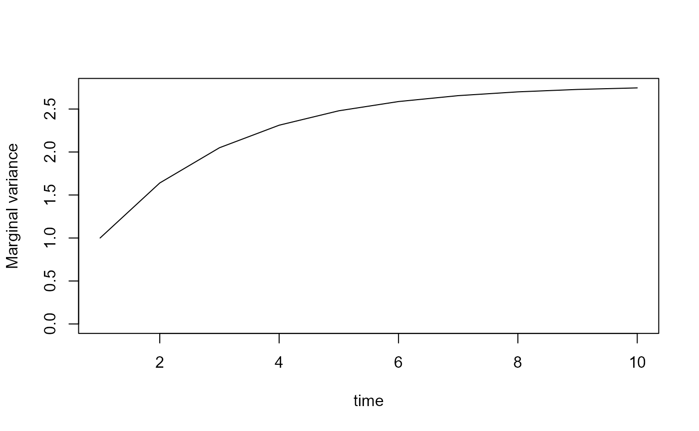
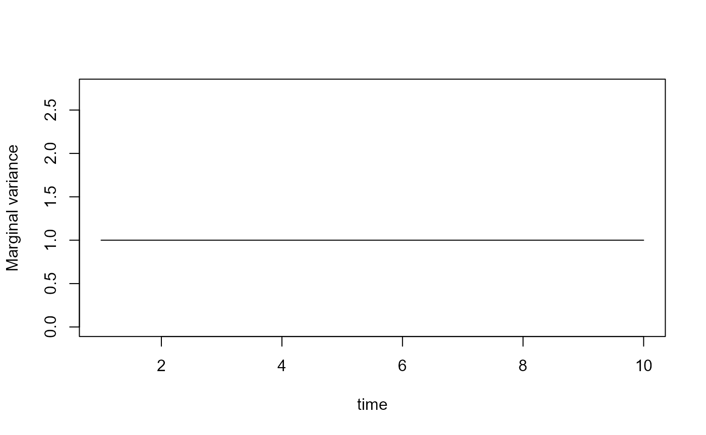

# dsem model description

## Dynamic structural equation models

Package *dsem* (Thorson et al. 2024) involves specifying a dynamic
structural equation model (DSEM). This DSEM be viewed either:

1.  *Weak interpretation*: as an expressive interface to parameterize
    the correlation among variables, using as many or few parameters as
    might be appropriate; or
2.  *Strong interpretation*: as a structural causal model, allowing
    predictions about the consequence of counterfactual changes to the
    system.

We introduce DSEM first from the perspective of a software user (i.e.,
the interface) and then from the perspective of a statistician (i.e.,
the equations and their interpretation).

#### Viewpoint 1: Software interface

To specify a DSEM, the user uses *arrow-and-lag notation*, based on
*arrow notation* derived from package `sem` (Fox 2006). For example, to
specify a first-order autoregressive process with variable $`x`$ this
involves:

``` r
x -> x, 1, ar1
x <-> x, 0, sd
```

This then estimates a single parameter representing first-order
autoregression (represented with a one-headed arrow), as well as the
Cholesky decomposition of the exogenous covariance of of model variables
(specified with two-headed arrows). See
[`?make_dsem_ram`](https://james-thorson-NOAA.github.io/dsem/reference/make_dsem_ram.md)
Details section for more details about syntax.

If there were four time-intervals ($`T=4`$) this would then result in
the path matrix:

``` math

\mathbf P_{\mathrm{joint}} = 
\begin{pmatrix}
  0 & 0 & 0 & 0 \\
  \rho & 0 & 0 & 0 \\
  0 & \rho & 0 & 0 \\
  0 & 0 & \rho & 0 
\end{pmatrix}
```
This joint path matrix then represents the partial effect of each
variable and time (column) on each other variable and time (row).

DSEM interactions can be as complicated or simple as desired, and can
include:

1.  Latent variables and loops (i.e., they are not restricted to
    directed acyclic graphs);
2.  Values that are fixed a priori, where the `parameter_name` is
    provided as `NA` and the starting value that follows is the fixed
    value;
3.  Values that are mirrored among path coefficients, where the same
    `parameter_name` is provided for multiple rows of the text file.

The user also specifies a distribution for measurement errors for each
variable using arguement `family`, and whether each time-series starts
from its stationary distribution or from some non-equilibrium initial
condition using argument `estimate_delta0`. If the latter is specified,
then variables will tend to converge back on the stationary distribution
at a rate that is determined by estimated parameters.

#### Viewpoint 2: Mathematical details

The DSEM defines a generalized linear mixed model (GLMM) for a
$`T \times J`$ matrix $`\mathbf{Y}`$, where $`y_{tj}`$ is the
measurement in time $`t`$ for variable $`j`$. This measurement matrix
can include missing values $`y_{tj} = \mathrm{NA}`$, and it will
estimate a $`T \times J`$ matrix of latent states $`\mathbf{X}`$ for all
modeled times and variables, where $`\mathbf{x}_t`$ is the vector of
states in time $`t`$ and $`\text{vec}(\mathbf{X})`$ is a $`TJ`$ length
vector constructed by stacking columns

DSEM defines this GLMM by specifying a vector autoregressive model of
arbitrary lag, from lag-0 upwards:

``` math

\mathbf{x}_t = \underbrace{\mathbf{P}_0 \mathbf{x}_t}_{\text{Simultaneous effects}} + 
\underbrace{\mathbf{P}_1 \mathbf{x}_{t-1}}_{\text{Lag-1 effects}} + 
\underbrace{\mathbf{P}_2 \mathbf{x}_{t-2}}_{\text{Lag-2 effects}} + 
\underbrace{...}_{\text{Higher-order lags}} + 
\mathbf{\epsilon}_t
```
where $`\mathbf{B}_0`$ is the $`J \times J`$ matrix of simultaneous
interactions, $`\mathbf{B}_1`$ and $`\mathbf{B}_2`$ are interactions
occurring at lag-1 and lag-2, respectively, and $`\mathbf{\epsilon}_t`$
is exogenous covariation:

``` math

\mathbf{\epsilon}_t \sim \text{MVN}(\mathbf{0,GG}^T)
```
and $`\mathbf{G}`$ is the square-root of exogenous covariance
$`\mathbf{GG}^T`$. With three times and a maximum lag of 2, this can be
rewritten as a joint simultaneous equation:

\$\$ \text{vec}(\mathbf{X}) = \mathbf{P}\_{\text{joint}}
\text{vec}(\mathbf{X}) + \text{vec}(\mathbf{E}) \\ \$\$

where:
``` math

\text{vec}(\mathbf{E}) \sim \text{MVN}(\mathbf{0},\mathbf{G}_{\text{joint}} \mathbf{G}_{\text{joint}}^T)
```
For illustration, when $`T=4`$ and given a maximum lag of 2, we can
write $`\mathbf{P}_{\text{joint}}`$ as:

``` math

\mathbf{P}_{\text{joint}} = 
\begin{pmatrix}
  \mathbf{P}_0 & 0 & 0 & 0\\
  \mathbf{P}_1 & \mathbf{P}_0 & 0 & 0\\
  \mathbf{P}_2 & \mathbf{P}_1 & \mathbf{P}_0 & 0\\
  0 & \mathbf{P}_2 & \mathbf{P}_1 & \mathbf{P}_0 \\
\end{pmatrix}
```

The specified DSEM then results in Gaussian Markov random field for
latent states:

``` math

\mathrm{vec}(\mathbf X) \sim \mathrm{GMRF}(\mathbf{0, Q}_{\mathrm{joint}})
```
where $`\mathbf Q_{\mathrm{joint}}`$ is a $`TJ \times TJ`$ precision
matrix such that $`\mathbf{Q_{\mathrm{joint}}}^{-1}`$ is the estimated
covariance among latent states. This joint precision is itself
constructed from a joint path matrix $`\mathbf P_{\mathrm{joint}}`$ and
a joint matrix of exogenous covariance $`\mathbf G_{\mathrm{joint}}`$:

``` math

\mathbf Q_{\mathrm{joint}} = ({\mathbf{I - P}_{\mathrm{joint}}}^T) \mathbf G_{\mathrm{joint}}^{-1} \mathbf G_{\mathrm{joint}}^{-T} (\mathbf{I - P_{\mathrm{joint}}})
```

The joint path matrix is itself constructed by summing across lagged and
simultaneous effects. Say we specify a model with $`K=2`$ one-headed
arrows. For each one-headed arrow, we define a $`J \times J`$ path
matrix $`\mathbf P_k`$ and a lag matrix $`\mathbf L_k`$. For example, in
a model with $`J=3`$ variables $`(A,B,C)`$ and $`T=4`$ times, and
specifying $`K=2`$ one-headed arrows:

``` r
A -> B, 0, b_AB
B -> C, 1, b_BC
```

this then results two path matrices:

``` math

\mathbf P_1 = 
\begin{pmatrix}
  0 & 0 & 0 \\
  b_{AB} & 0 & 0 \\
  0 & 0 & 0 \\
\end{pmatrix}
```
and
``` math

\mathbf P_2 = 
\begin{pmatrix}
  0 & 0 & 0 \\
  0 & 0 & 0 \\
  0 & b_{BC} & 0 \\
\end{pmatrix}
```
with corresponding lag matrices

``` math

\mathbf L_{1} = 
\begin{pmatrix}
  1 & 0 & 0 & 0 \\
  0 & 1 & 0 & 0 \\
  0 & 0 & 1 & 0 \\
  0 & 0 & 0 & 1 
\end{pmatrix}
```
and
``` math

\mathbf L_{2} = 
\begin{pmatrix}
  0 & 0 & 0 & 0 \\
  1 & 0 & 0 & 0 \\
  0 & 1 & 0 & 0 \\
  0 & 0 & 1 & 0 
\end{pmatrix}
```
We then sum across the Kronecker product of these components to obtain
the joint path matrix:

``` math

\mathbf P_{\mathrm{joint}} = \sum_{k=1}^{K}(\mathbf L_k \otimes \mathbf P_k)
```
where $`\otimes`$ is the Kronecker product. Similarly, the exogenous
covariance is similar constructed from a Kronecker product, although we
assume that all covariance is simultaneous (i.e., no lags are allowed
for two-headed arrows):

``` math

\mathbf G_{\mathrm{joint}} = \mathbf I \otimes \mathbf G
```

### Measurement errors

DSEM includes multiple distribution for measurement errors. For example,
if the user specifies `family[j] = "fixed"` then:

``` math

y_{tj} = x_{tj} + d_{tj}
```
for all years. Alternatively, if the user specifies
`family[j] = "normal"` then:
``` math

y_{tj} \sim \mathrm{Normal}( x_{tj} + d_{tj}, {\sigma_j}^2)
```
and $`{\sigma_j}^2`$ is then included as an estimated parameter. When
estimating missing values or masurement errors in $`\mathbf{Y}`$, *dsem*
must then marginalize across the latent value of states $`\mathbf{X}`$.
It does this using the Laplace approximation (Skaug and Fournier 2006),
as implemented using the R-package TMB (Kristensen et al. 2016).
Computations involving sparse matrices are efficient using the Matrix
package (Bates, Maechler, and Jagan 2023) to interface with the Eigen
library (Guennebaud, Jacob, et al. 2010).

These expressions include the $`T \times J`$ matrix $`\mathbf D`$
representing the ongoing impact of initial conditions $`d_{tj}`$ for
each variable and year, as explained in detail next.

### Initial conditions and total effects

Imagine we have some exogenous intervention that caused a $`T \times J`$
matrix of changes $`\mathbf C`$. The total effect of this exogenous
intervention would then be
$`(\mathbf{I - P}_{\mathrm{joint}})^{-1} \mathrm{vec}(\mathbf C)`$, and
we can calculate any total effect using this matrix inverse
$`(\mathbf{I - P}_{\mathrm{joint}})^{-1}`$ (called the “Leontief
matrix”). To see this, consider that the first-order effect of change
$`\mathbf C`$ is $`\mathbf P_{\mathrm{joint}} \mathrm{vec}(\mathbf C)`$,
but this response then in turn causes a second-order effect
$`\mathbf{P_{\mathrm{joint}}}^2 \mathrm{vec}(\mathbf C)`$, and so on.
The total effect is therefore:

``` math

\sum_{l=0}^{\infty} \mathbf{P_{\mathrm{joint}}}^l = (\mathbf{I - P}_{\mathrm{joint}})^{-1}
```
where this power-series of direct and indirect effects then results in
the Leontief matrix (as long as the $`\mathbf{I - P}`$ is invertible).

We can use this expression to calculate the matrix $`\mathbf D`$
represents the ongoing effect of initial conditions. It is constructed
from a $`J`$ length vector of estimated initial conditions
$`\mathbf\delta_1`$ in time $`t=1`$, and we construct a $`T \times J`$
matrix $`\mathbf\Delta`$ where the first row (corresponding to year
$`t=1`$) is $`\mathbf\delta_1`$ and all other elements are $`0`$. The
ongoing effect of initial conditions can then be calculated as:

``` math

\mathrm{vec}(\mathbf D) = (\mathbf{I - P}_{\mathrm{joint}})^{-1} \mathrm{vec}(\mathbf\Delta)
```
Calculating the effect of initial conditions is in a sense the total
effect of $`\mathbf\delta_1`$ in year $`t=1`$ on subsequent years.
Calculating the effect $`\mathbf D`$ of initial conditions involves
inverting $`\mathbf{I - P}_{\mathrm{joint}}`$, but this is
computationally efficient using a sparse LU decomposition.

### Constant conditional vs. marginal variance

We have defined the joint precision for a GMRF based on a path matrix
and matrix of exogenous covariances. The exogenous (or conditional)
variances are stationary for each variable over time, and some path
matrices will result in a nonstationary marginal variance. To see this,
consider a first-order autoregressive process

``` r
dsem = " 
x -> x, 1, ar1, 0.8
x <-> x, 0, sd, 1
"
```

We can parse this DSEM and construct the precision using internal
functions:

``` r
# Load package
library(dsem)

# call dsem without estimating parameters
out = dsem(
  tsdata = ts(data.frame( x = rep(1,10) )),
  sem = dsem,
  control = dsem_control(
    run_model = FALSE, 
    quiet = TRUE
  )
)

# Extract covariance
Sigma1 = solve(as.matrix(out$obj$report()$Q_kk))
plot( x=1:10, y = diag(Sigma1), xlab="time", 
      ylab="Marginal variance", type="l", 
      ylim = c(0,max(diag(Sigma1))))
```



where we can see that the diagonal of this covariance matrix is
non-constant.

We therefore derive an alternative specification that preserves a
stationary marginal variance by rescaling the exogenous (conditional)
variance.

Specifically, we see that the marginal variance is:

\$\$ \mathrm{Var}(\mathbf X) = \mathrm{diag}(\mathbf\Sigma) = \mathbf{ L
L}^T \\ \mathbf L = (\mathbf{I - P}\_{\mathrm{joint}})^{-1} \mathbf G
\$\$ Given the properties of the Hadamard (elementwise) product, this
can be rewritten as:

``` math

\mathrm{diag}(\mathbf\Sigma) = \mathbf{(L \circ L) 1} 
```
Now suppose we have a desired vector of length $`TJ`$ for the constant
marginal variance $`\mathbf v`$. We can solve for the exogenous
covariance that would result in that marginal variance:

``` math

\mathbf u = \mathbf{(L \circ L)}^{-1} \mathbf v
```

and we can then rescale the exogenous covariance:

``` math

\mathrm{diag}(\mathbf G^*) = \mathbf u
```
and then using this rescaled exogenous covariance when constructing the
precision of the GMRF. We can see this again using our first-order
autoregressive example

``` r
# call dsem without estimating parameters
out = dsem(
  tsdata = ts(data.frame( x = rep(1,10) )),
  sem = dsem,
  control = dsem_control(
    run_model = FALSE, 
    quiet = TRUE, 
    constant_variance = "marginal"
  )
)

# Extract covariance
Sigma2 = solve(as.matrix(out$obj$report()$Q_kk))
plot( x=1:10, y = diag(Sigma2), xlab="time", 
      ylab="Marginal variance", type="l", 
      ylim = c(0,max(diag(Sigma1))))
```



This shows that the corrected (nonstationary) exogenous variance results
in a stationary marginal variance for the AR1 process. This correction
can be done in two different ways that are identical when the exogenous
covariance is diagonal (as it is in this simple example), but differ
when specifying some exogenous covariance. However, we do not discuss
this in detail here. Note that this calculating this correction for a
constant marginal variance requires the inverse of the squared values of
Leontief matrix (which is itself a matrix inverse). It therefore is
computationally expensive for large models containing complicated
dependencies.

### Reduced rank models

We note that some DSEM specifications will be reduced rank. This arises
for example when specifying a dynamic factor analysis, where $`J`$
variables are explained by $`F < J`$ factors that each follow a random
walk:

``` r
#
dsem = "
  # Factor follows random walk with unit variance
  F <-> F, 0, NA, 1
  F -> F, 1, NA, 1
  # Loadings on two manifest variables
  F -> x, 0, b_x, 1
  F -> y, 0, b_y, 1
  # No residual variance for manifest variables
  x <-> x, 0, NA, 0
  y <-> y, 0, NA, 0
"
data = data.frame( 
  x = rnorm(10),
  y = rnorm(10),
  F = rep(NA,10)
)

# call dsem without estimating parameters
out = dsem(
  tsdata = ts(data),
  sem = dsem,
  family = c("normal","normal","fixed"),
  control = dsem_control(
    run_model = FALSE, 
    quiet = TRUE,
    gmrf_parameterization = "projection"
  )
)
```

We can extract the covariance and inspect the eigenvalues:

``` r
# Extract covariance
library(Matrix)
IminusRho_kk = out$obj$report()$IminusRho_kk
G_kk = out$obj$report()$Gamma_kk
Q_kk = t(IminusRho_kk) %*% t(G_kk) %*% G_kk %*% IminusRho_kk

# Display eigenvalues
eigen(Q_kk)$values
#>  [1] 3.91114561 3.65247755 3.24697960 2.73068205 2.14946019 1.55495813
#>  [7] 1.00000000 0.53389626 0.19806226 0.02233835 0.00000000 0.00000000
#> [13] 0.00000000 0.00000000 0.00000000 0.00000000 0.00000000 0.00000000
#> [19] 0.00000000 0.00000000 0.00000000 0.00000000 0.00000000 0.00000000
#> [25] 0.00000000 0.00000000 0.00000000 0.00000000 0.00000000 0.00000000
```

where this shows that the precision has a rank of 10 while being a
$`30 \times 30`$ matrix. We therefore cannot evaluate the probability
density of state matrix $`\mathbf X`$ using this precision matrix (i.e.,
the log-determinant is not defined).

To address this circumstance, we can switch to using
`gmrf_parameterization = "projection"`. This evaluates the probability
density of a set of innovations $`\mathbf X^*`$ that follow a unit
variance:

``` math

\mathrm{vec}(\mathbf X)^* \sim \mathrm{GMRF}(\mathbf{0, I})
```
and then projects these full-rank innovations to the reduced rank
states:

``` math

\mathrm{vec}(\mathbf X) = (\mathbf{I - P}_{\mathrm{joint}})^{-1} \mathbf G_{\mathrm{joint}} \mathrm{vec}(\mathbf X)^*
```

This parameterization allows us to fit DSEM using a rank-deficient
structural model.

## Works cited

Bates, Douglas, Martin Maechler, and Mikael Jagan. 2023. *Matrix: Sparse
and Dense Matrix Classes and Methods*.
<https://CRAN.R-project.org/package=Matrix>.

Fox, John. 2006. “Structural Equation Modeling with the Sem Package in
R.” *Structural Equation Modeling-a Multidisciplinary Journal* 13:
465–86.

Guennebaud, G., B. Jacob, et al. 2010. “Eigen V3.”
<http://eigen.tuxfamily.org>.

Kristensen, Kasper, Anders Nielsen, Casper W. Berg, Hans Skaug, and
Bradley M. Bell. 2016. “TMB: Automatic Differentiation and Laplace
Approximation.” *Journal of Statistical Software* 70 (5): 1–21.
<https://doi.org/10.18637/jss.v070.i05>.

Skaug, Hans, and Dave Fournier. 2006. “Automatic Approximation of the
Marginal Likelihood in Non-Gaussian Hierarchical Models.” *Computational
Statistics & Data Analysis* 51 (2): 699–709.

Thorson, James T., Alexander G. Andrews III, Timothy E. Essington, and
Scott I. Large. 2024. “Dynamic Structural Equation Models Synthesize
Ecosystem Dynamics Constrained by Ecological Mechanisms.” *Methods in
Ecology and Evolution* 15 (4): 744–55.
<https://doi.org/10.1111/2041-210X.14289>.
