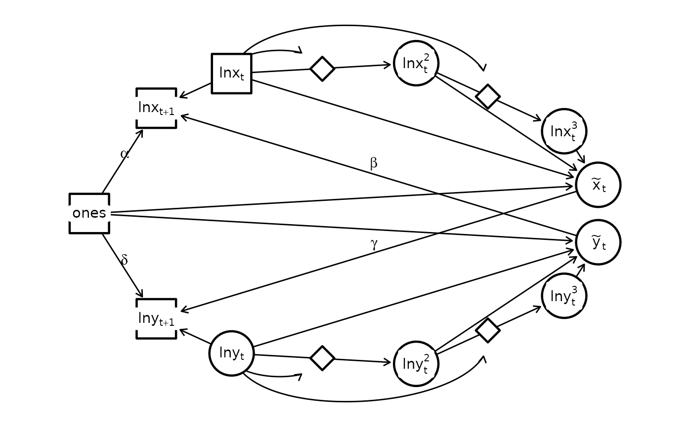

# Nonlinear dynamics

## Nonlinearity

`dsem` can be specified to estimate some types of nonlinearity. Here, we
demonstrate an approximation to the exponential function using
Lotka-Volterra dynamics.

To show this, we predict sea surface temperature from Departure Bay
based upon the Pacific Decadal Oscillation:

``` r

library(dsem)
dataset = c("hare_lynx", "paramesium_didinium" )[2]

# Load data
if( dataset == "paramesium_didinium" ){
  data(paramesium_didinium)
  orig_dat = data.frame( 
    X = paramesium_didinium[,'paramecium'] / 100,
    Y = paramesium_didinium[,'didinium'] / 100 
  )
}
if( dataset == "hare_lynx" ){
  data(hare_lynx)
  orig_dat = data.frame( X = hare_lynx$hares / 10000, Y = hare_lynx$lynx / 10000 )
}

# Format
dat = full_dat = cbind(
  logX = log(orig_dat$X), logY = log(orig_dat$Y),
  X = NA, Y = NA,
  logX1 = NA, logY1 = NA,
  logX2 = NA, logY2 = NA,
  logX3 = NA, logY3 = NA,
  ones = 1
)

# Center variables for numerical stability
mean_j = colMeans( dat[,1:2], na.rm = TRUE )
dat[,1:2] = sweep( dat[,1:2], FUN = "-", MARGIN = 2, STATS = mean_j )
```

We then define a MDSEM:

``` r

sem = "
  # Main interactions
  logX -> logX, 1, NA, 1
  ones -> logX, 0, alpha
  Y -> logX, 1, beta, -0.1

  # Form X \approx exp(logX)
  ones -> X, 0, NA, 1
  logX -> logX1, 0, NA, 1
  logX1 -> X, 0, NA, 1
  logX1 -> logX2, 0, logX
  logX2 -> X, 0, NA, 0.5
  logX2 -> logX3, 0, logX
  logX3 -> X, 0, NA, 0.166

  # Variances
  X <-> X, 0, NA, 0
  logX <-> logX, 0, sd_logX
  logX1 <-> logX1, 0, NA, 0
  logX2 <-> logX2, 0, NA, 0
  logX3 <-> logX3, 0, NA, 0

  # Main interactions
  logY -> logY, 1, NA, 1
  X -> logY, 1, gamma
  ones -> logY, 0, delta, -0.1

  # Form Y \approx exp(logY)
  ones -> Y, 0, NA, 1
  logY -> logY1, 0, NA, 1
  logY1 -> Y, 0, NA, 1
  logY1 -> logY2, 0, logY
  logY2 -> Y, 0, NA, 0.5
  logY2 -> logY3, 0, logY
  logY3 -> Y, 0, NA, 0.166

  # Variances
  Y <-> Y, 0, NA, 0
  logY <-> logY, 0, sd_logY
  logY1 <-> logY1, 0, NA, 0
  logY2 <-> logY2, 0, NA, 0
  logY3 <-> logY3, 0, NA, 0

  # Dummy constant
  ones <-> ones, 0, NA, 0.001
  ones -> ones, 1, NA, 1
"
```

We then fit this without estimating any `mu` parameters:

``` r

fit = dsem(
  tsdata = ts(dat),
  sem = sem,
  estimate_mu = vector(), 
  estimate_delta0 = FALSE,
  control = dsem_control(
    quiet = TRUE
  )
)
```

We can also visualize the estimated graph

``` r

library(igraph)
library(ggraph)

g = make_empty_graph(15)
V(g)$name = c("ones", "lnx[t+1]", "lnx", "z1", "lnx^2", "z2", "lnx^3", "x", "y", "lny^3", "z3", "lny^2", "z4", "lny", "lny[t+1]" )
V(g)$shape = c( "square", "circle", "diamond")[c(1,1,1,3,2,3,2,2,2,2,3,2,3,2,1)]
V(g)$label = c("ones", "lnx[t+1]", "lnx[t]", "", "lnx[t]^2", "", "lnx[t]^3", "tilde(x)[t]", "tilde(y)[t]", "lny[t]^3", "", "lny[t]^2", "", "lny[t]", "lny[t+1]" )

#
g <- add_edges(g, c("ones", "lnx[t+1]"), attr = list(label = "alpha", type = "solid", col = "black", curve = 0))
g <- add_edges(g, c("lnx", "lnx[t+1]"), attr = list(label = "", type = "solid", col = "black", curve = 0))
g <- add_edges(g, c("lnx", "lnx^2"), attr = list(label = "", type = "solid", col = "black", curve = 0))
g <- add_edges(g, c("lnx^2", "lnx^3"), attr = list(label = "", type = "solid", col = "black", curve = 0))
#
g <- add_edges(g, c("ones", "x"), attr = list(label = "", type = "solid", col = "black", curve = 0))
g <- add_edges(g, c("lnx", "x"), attr = list(label = "", type = "solid", col = "black", curve = 0))
g <- add_edges(g, c("lnx^2", "x"), attr = list(label = "", type = "solid", col = "black", curve = 0))
g <- add_edges(g, c("lnx^3", "x"), attr = list(label = "", type = "solid", col = "black", curve = 0))
g <- add_edges(g, c("x", "lny[t+1]"), attr = list(label = "gamma", type = "solid", col = "black", curve = 0))
#
g <- add_edges(g, c("lnx", "z1"), attr = list(label = "", type = "solid", col = "black", curve = 1))
g <- add_edges(g, c("lnx", "z2"), attr = list(label = "", type = "solid", col = "black", curve = 1))
#
g <- add_edges(g, c("ones", "lny[t+1]"), attr = list(label = "delta", type = "solid", col = "black", curve = 0))
g <- add_edges(g, c("lny", "lny[t+1]"), attr = list(label = "", type = "solid", col = "black", curve = 0))
g <- add_edges(g, c("lny", "lny^2"), attr = list(label = "", type = "solid", col = "black", curve = 0))
g <- add_edges(g, c("lny^2", "lny^3"), attr = list(label = "", type = "solid", col = "black", curve = 0))
#
g <- add_edges(g, c("ones", "y"), attr = list(label = "", type = "solid", col = "black", curve = 0))
g <- add_edges(g, c("lny", "y"), attr = list(label = "", type = "solid", col = "black", curve = 0))
g <- add_edges(g, c("lny^2", "y"), attr = list(label = "", type = "solid", col = "black", curve = 0))
g <- add_edges(g, c("lny^3", "y"), attr = list(label = "", type = "solid", col = "black", curve = 0))
g <- add_edges(g, c("y", "lnx[t+1]"), attr = list(label = "beta", type = "solid", col = "black", curve = 0))
#
g <- add_edges(g, c("lny", "z4"), attr = list(label = "", type = "solid", col = "black", curve = -1))
g <- add_edges(g, c("lny", "z3"), attr = list(label = "", type = "solid", col = "black", curve = -1))

pos = function(i){
  rad = i/17*2*pi - 0.25*2*pi
  return( c(x=sin(rad),y = cos(rad)) )
}
loc_nodes = t(sapply(c(0,2:14,15), pos))
# Manual fixes
loc_nodes[4,] = loc_nodes[4,] + c(0, -0.07)
loc_nodes[6,] = loc_nodes[6,] + c(-0.05, -0.05)
loc_nodes[11,] = loc_nodes[11,] + c(-0.05, 0.05)
loc_nodes[13,] = loc_nodes[13,] + c(0, 0.07)

layout = create_layout( g, loc_nodes[,c("x","y")] )
ggraph(layout) +
  geom_edge_link2(
    arrow = arrow(length = unit(2, "mm")),
    end_cap = ggraph::circle(7, 'mm'),
    start_cap = ggraph::circle(0, 'mm'),
    aes( label = label, linetype = type, col = "black", filter = (curve==0) ),  # , edge_width = ifelse(type == "dotted", 0.8, 0.8)
    vjust = -0.2,
    hjust = 0.4,
    label_parse = TRUE
  ) +
  geom_edge_arc(
    arrow = arrow(length = unit(2, "mm")),
    end_cap = ggraph::circle(7, 'mm'),
    start_cap = ggraph::circle(0, 'mm'),
    strength = 1,
    aes( label = label, linetype = type, col = col, filter = (curve==1) ),  # , edge_width = ifelse(type == "dotted", 0.8, 0.8)
    vjust = -0.2,
    hjust = 0.4,
    label_parse = TRUE
  ) +
  geom_edge_arc(
    arrow = arrow(length = unit(2, "mm")),
    end_cap = ggraph::circle(7, 'mm'),
    start_cap = ggraph::circle(0, 'mm'),
    strength = -1,
    aes( label = label, linetype = type, col = col, filter = (curve==-1) ),  # , edge_width = ifelse(type == "dotted", 0.8, 0.8)
    vjust = -0.2,
    hjust = 0.4,
    label_parse = TRUE
  ) +
  geom_node_point(
    aes(shape = shape, size = ifelse(shape == "diamond",8,15) ),   #
    #size = 15,
    stroke = 1.2,
    color = "black",
    fill = "white"
  ) +
  geom_node_label(
    fill = "white",
    lwd = 0,
    aes(label = label),
    parse = TRUE
  ) +
  theme(panel.background = element_rect(fill = NA, color = NA)) +
  coord_cartesian( xlim = 1.2*c(-1, 1), ylim = 1.2*c(-1, 1) )  +
  scale_shape_manual(values = c("circle" = 21, "square" = 22, "diamond" = 23), guide = "none") +  # ?scale_shape
  scale_edge_linetype_manual(values = c("solid" = "solid", "dotted" = "solid"), guide = "none") +
  scale_edge_colour_manual(values = c("black" = "black", "grey" = "grey"), guide = "none") +
  scale_size( range = c(6,15), guide = "none" )
```



Runtime for this vignette: 3.84 secs
