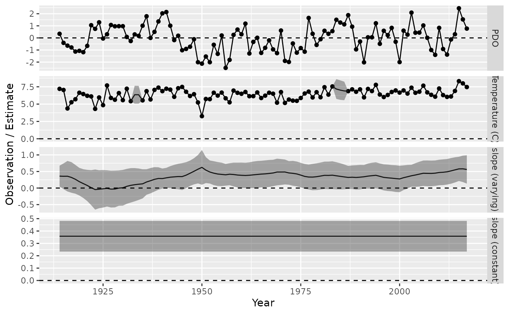
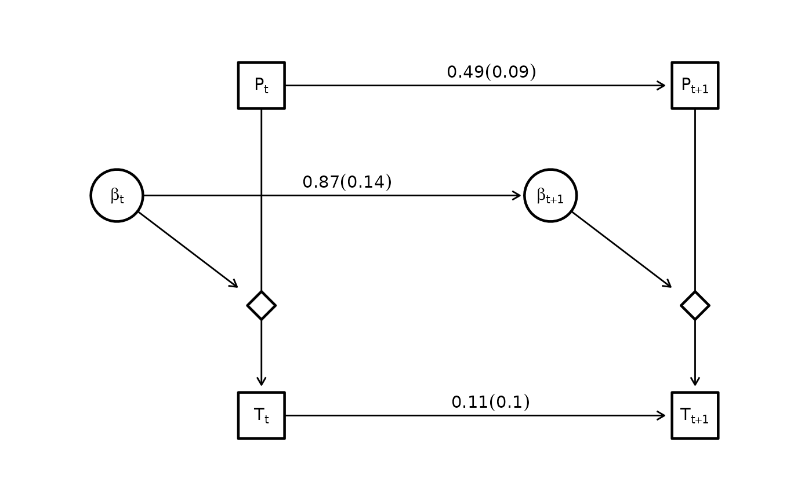

# Random slopes

## Random slopes models

`dsem` can be specified to estimate variation over time in a slope
parameter that measures the impact of one variable on another.

To show this, we predict sea surface temperature from Departure Bay
based upon the Pacific Decadal Oscillation:

``` r

library(dsem)

# Load data
data(pdo_departure_bay)

# Format
tsdata = ts(data.frame(
  Temp = pdo_departure_bay[,2],
  PDO = pdo_departure_bay[,3],
  slope = NA
), start = 1914 )
```

We first fit these data using a stationary slope parameter:

``` r

# Model
sem = "
  PDO -> Temp, 0, slope
  PDO -> PDO, 1, ar_PDO
  Temp -> Temp, 1, ar_Temp
"

# Fit
fit0 = dsem(
  tsdata = tsdata[,1:2],
  sem = sem,
  estimate_mu = colnames(tsdata)[1:2],
  estimate_delta0 = FALSE,
  control = dsem_control(
    quiet = TRUE,
    use_REML = FALSE
  )
)
```

We then re-fit while estimating the slope parameter as a model variable
that follows a first-order autoregressive process:

``` r

# Model
sem = "
  PDO -> Temp, 0, slope
  slope -> slope, 1, ar_slope
  PDO -> PDO, 1, ar_PDO
  Temp -> Temp, 1, ar_Temp
"

# Fit
fit = dsem(
  tsdata = tsdata,
  sem = sem,
  estimate_mu = colnames(tsdata),
  estimate_delta0 = FALSE,
  control = dsem_control(
    quiet = TRUE,
    use_REML = FALSE,
    gmrf_parameterization = "full"
  )
)
```

We then plot the predicted state-variables:

``` r

# get estimates and SEs for first model
df = expand.grid( year = time(tsdata), var = colnames(tsdata))
df$est = as.vector(as.list(fit$sdrep, what = "Estimate", report = TRUE)$z_tj)
df$se = as.vector(as.list(fit$sdrep, what = "Std. Error", report = TRUE)$z_tj)
df$obs = as.vector(tsdata)

# get estimates and SEs for second model
df0 = expand.grid( year = time(tsdata), var = "constant_slope" )
df0$est =  subset( summary(fit0), path == "PDO -> Temp" )$Estimate
df0$se =  subset( summary(fit0), path == "PDO -> Temp" )$Std_Error
df0$obs = NA

# Combine
df = rbind( df, df0 )
df$var = factor( df$var, levels = c("PDO","Temp","slope","constant_slope") )

# Plot
library(ggplot2)
ggplot(df) +
  geom_line( aes( x=year, y = est) ) +
  geom_point( aes( x=year, y = obs) ) +
  geom_ribbon( aes( x = year, ymin = est - 1.96*se, ymax = est + 1.96*se), alpha = 0.4 ) +
  facet_grid( vars(var), scales = "free_y", labeller =
              labeller(var = c(PDO = "PDO", Temp = "Temperature (C)", slope = "slope (varying)", constant_slope = "slope (constant)")) ) +
  geom_hline(yintercept = 0, linetype = "dashed", color = "black") +
  labs(x = "Year", y = "Observation / Estimate")
#> Warning: Removed 213 rows containing missing values or values outside the scale range
#> (`geom_point()`).
```



And can also visualize the estimated graph

``` r

library(igraph)
library(ggraph)

g = make_empty_graph(8)
V(g)$name = c("P[t]", "T[t]", "z[t]", "b[t]", "P[t+1]", "T[t+1]", "z[t+1]", "b[t+1]")
V(g)$shape = c( "square","square","diamond","circle", "square","square","diamond","circle" )
V(g)$label = c("P[t]", "T[t]", "", "beta[t]", "P[t+1]", "T[t+1]", "", "beta[t+1]")

#
g <- add_edges(g, c("P[t]", "T[t]"), attr = list(label = "", type = "solid", col = "black"))
g <- add_edges(g, c("P[t+1]", "T[t+1]"), attr = list(label = "", type = "solid", col = "black"))
g <- add_edges(g, c("b[t]", "z[t]"), attr = list(label = "", type = "solid", col = "black"))
g <- add_edges(g, c("b[t+1]", "z[t+1]"), attr = list(label = "", type = "solid", col = "black"))
# ARs
val = paste0( round(subset(summary(fit),path == "slope -> slope")$Estimate,2), " (", round(subset(summary(fit),path == "slope -> slope")$Std_Error,2),")")
g <- add_edges(g, c("b[t]", "b[t+1]"), attr = list(label = val, type = "dotted", col = "grey"))
val = paste0( round(subset(summary(fit),path == "PDO -> PDO")$Estimate,2), " (", round(subset(summary(fit),path == "PDO -> PDO")$Std_Error,2),")")
g <- add_edges(g, c("P[t]", "P[t+1]"), attr = list(label = val, type = "dotted", col = "grey"))
val = paste0( round(subset(summary(fit),path == "Temp -> Temp")$Estimate,2), " (", round(subset(summary(fit),path == "Temp -> Temp")$Std_Error,2),")")
g <- add_edges(g, c("T[t]", "T[t+1]"), attr = list(label = val, type = "dotted", col = "grey"))

loc_nodes = rbind(
  c(x = 1, y = 3),
  c(1,0),
  c(1,1),
  c(0,2),
  c(4,3),
  c(4,0),
  c(4,1),
  c(3,2)
)

layout = create_layout( g, loc_nodes[,c("x","y")] )
ggraph(layout) +
  geom_edge_link2(
    arrow = arrow(length = unit(2, "mm")),
    end_cap = ggraph::circle(7, 'mm'),
    start_cap = ggraph::circle(0, 'mm'),
    aes( label = label, linetype = type, col = col ),  # , edge_width = ifelse(type == "dotted", 0.8, 0.8)
    vjust = -0.2,
    hjust = 0.4,
    label_parse = TRUE
  ) +
  geom_node_point(
    aes(shape = shape, size = ifelse(shape == "diamond",8,15) ),
    #size = 15,
    stroke = 1.2,
    color = "black",
    fill = "white"
  ) +
  geom_node_label(
    fill = "white",
    lwd = 0,
    aes(label = label),
    parse = TRUE
  ) +
  theme(panel.background = element_rect(fill = NA, color = NA)) +
  coord_cartesian( xlim = c(-0.5, 4.5), ylim = c(-0.5, 3.5) )  +
  scale_shape_manual(values = c("circle" = 21, "square" = 22, "diamond" = 23), guide = "none") +  # ?scale_shape
  scale_edge_linetype_manual(values = c("solid" = "solid", "dotted" = "solid"), guide = "none") +
  scale_edge_colour_manual(values = c("black" = "black", "grey" = "black"), guide = "none") +
  scale_size( range = c(6,15), guide = "none" )
```



Runtime for this vignette: 7.2 secs
