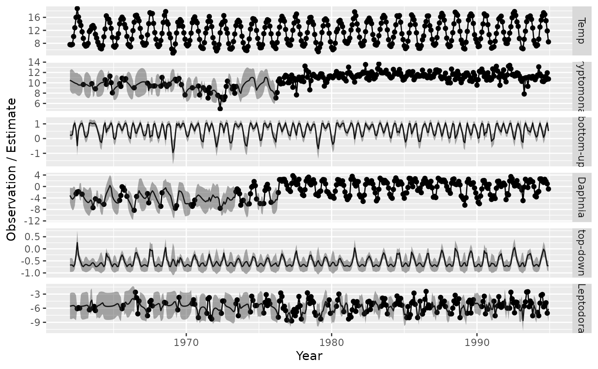
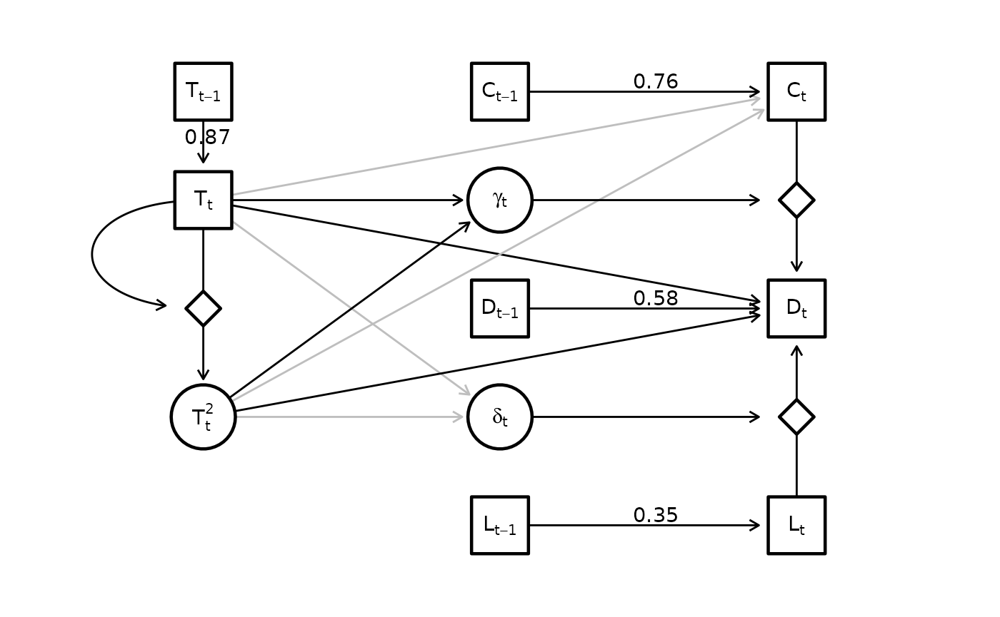

# Statistical interactions

## Statistical interactions

`dsem` can be specified to estimate statistical interactions, where the
product of two variables then as an additive impact on a response.

To show this, we fit a dome-shaped response of species interactions to
temperature in a resource-consumer-predator model:

``` r

library(dsem)

# Load data
data(lake_washington)

# Format
Z = ts(cbind(
  Temp = lake_washington[,"Temp"] - 10,
  log(lake_washington[,c("Daphnia","Leptodora","Cryptomonas")]),    
  "alpha" = NA, "Temp2" = NA, "beta" = NA                  
), start = 1962, freq = 12)
```

We first define a model with multiple dome-shaped responses to Temp,
specifically constructing temperature-squared as a latent variable:

``` r

#
sem = "
  # Quadratic temperature effect on resource density
  Temp -> Cryptomonas, 0, T_to_C
  Temp2 -> Cryptomonas, 0, T2_to_C

  # Quadratic temperature effect on consumer density
  Temp -> Daphnia, 0, T_D
  Temp2 -> Daphnia, 0, T2_D

  # Resource and Predator impacts on consumer
  Cryptomonas -> Daphnia, 0, alpha  #  C_D
  Leptodora -> Daphnia, 1, beta   # alpha

  # Density dependence
  Cryptomonas -> Cryptomonas, 1, ar_C
  Daphnia -> Daphnia, 1, ar_D
  Leptodora -> Leptodora, 1, ar_L
  Temp -> Temp, 1, ar_T

  # Form Temp^2
  Temp -> Temp2, 0, Temp
  Temp2 <-> Temp2, 0, NA, 0.001

  # Quadratic temperature on resource-consumer slope
  alpha <-> alpha, 0, NA, 0.001
  Temp -> alpha, 0, T_alpha
  Temp2 -> alpha, 0, T2_alpha

  # Quadratic temperature on predator-consumer slope
  beta <-> beta, 0, NA, 0.001
  Temp -> beta, 0, T_beta
  Temp2 -> beta, 0, T2_beta
"
```

We then fit this model using `gmrf_parameterization = "full"`

``` r

fit = dsem(
  tsdata = Z,
  sem = sem,
  estimate_mu = c("Daphnia","Leptodora","Cryptomonas","alpha","beta"),
  control = dsem_control(
    use_REML = TRUE,  
    newton_loops = 0,
    gmrf_parameterization = "full", 
    quiet = TRUE,
    extra = FALSE,
    getJointPrecision = TRUE
  )
)
```

We then plot the temperatures responses

``` r

T_j = seq( 5, 19, by = 0.1 )
X_j = T_j - 10

mu_df = data.frame(
  Par = colnames(Z),
  Est = as.list(fit$sdrep,"Estimate")$mu_j,
  SE = as.list(fit$sdrep,"Std. Error")$mu_j
)

plot_interval = function( fit, var, name1, name2, n = 1000, prob = c(0.025,0.975), f_y = identity, ... ){
  # fit$sdrep$jointPrecision
  mu_i = match( var, c("Daphnia","Leptodora","Cryptomonas","alpha","beta") )
  b1_i = subset(summary(fit), name==name1)$parameter
  b2_i = subset(summary(fit), name==name2)$parameter
  index = c(
    grep( "mu_j", rownames(fit$sdrep$jointPrecision) )[mu_i],
    grep( "beta_z", rownames(fit$sdrep$jointPrecision) )[c(b1_i,b2_i)]
  )
  p1 = subset(mu_df, Par==var)$Est
  p2 = subset(summary(fit),name==name1)$Estimate
  p3 = subset(summary(fit),name==name2)$Estimate
  beta = RTMB:::rgmrf0( Q = fit$sdrep$jointPrecision, n = n )[index,]
  beta = beta + outer( c(p1,p2,p3), rep(1,n) )
  #return(beta)
  response = apply( beta, MARGIN = 2, FUN = \(x) x[1] + x[2]*X_j + x[3]*X_j^2 )
  interval = apply( response, MARGIN = 1, FUN = quantile, prob = prob )
  #
  Y_j = p1 + p2 * X_j + p3 * X_j^2
  plot( x = T_j, y = f_y(Y_j), type = "l", ylim = range(f_y(interval)), ... )
  polygon( x = c(T_j,rev(T_j)), y = f_y(c(interval[1,],rev(interval[2,]))), border = NA, col = rgb(0,0,0,0.2) )
}

par( mfrow = c(2,2), mgp = c(2,0.5,0), tck = -0.02, mar = c(1,1,2.5,1), oma = c(2,2,0,0), xaxs = "i" )
# Resource
plot_interval( fit, "Cryptomonas", "T_to_C", "T2_to_C", f_y = exp, xlab = "", ylab = "", main = "Cryptomonas density", log = "y", xaxt = "n", n = 5000 )
mtext( side = 2, text = "Impact on intercepts", line = 2 )
# Consumer
plot_interval( fit, "Daphnia", "T_D", "T2_D", f_y = exp, xlab = "", ylab = "", main = "Daphnia density", log = "y", xaxt = "n", n = 5000 )
# Bottom-up
plot_interval( fit, "alpha", "T_alpha", "T2_alpha", xlab = "", ylab = "", main = "Cryptomonas impact\non Daphnia", n = 5000 )
mtext( side = 2, text = "Impact on slopes", line = 2 )
# Top-down
plot_interval( fit, "beta", "T_beta", "T2_beta", xlab = "", ylab = "", main = "Leptodora impact\non Daphnia", n = 5000 )
mtext( side = 1, text = c("Temperature (C)"), outer = TRUE, line = c(1) )
```


We next visualize the predicted state-variables

``` r

#
df = expand.grid( year = as.vector(time(Z)), var = colnames(Z) )
df$est = as.vector(as.list(fit$sdrep, what = "Estimate", report = TRUE)$z_tj)
df$se = as.vector(as.list(fit$sdrep, what = "Std. Error", report = TRUE)$z_tj)
df$obs = as.vector(Z)
df = subset( df, var != "Temp2" )
df$var = factor( df$var, levels = c("Temp", "Cryptomonas", "alpha", "Daphnia", "beta", "Leptodora") )

#
df[which(df$var=="Temp"),c("obs","est")] = df[which(df$var=="Temp"),c("obs","est")] + 10
#df[which(df$var %in% c("Daphnia","Leptodora","Cryptomonas")),c("obs","est")] = df[which(df$var=="Temp"),c("obs","est")] + 10

#
library(ggplot2)
ggplot(df) +
  geom_line( aes( x=year, y = est) ) +
  geom_point( aes( x=year, y = obs) ) +
  geom_ribbon( aes( x = year, ymin = est - 1.96*se, ymax = est + 1.96*se), alpha = 0.4 ) +
  facet_grid( vars(var), scales = "free_y",
              labeller = labeller( var = c(Temp = "Temp", Daphnia = "Daphnia", Leptodora = "Leptodora", Cryptomonas = "Cryptomonas",
                                   alpha = "bottom-up", beta = "top-down" ) ) ) +
  labs(x = "Year", y = "Observation / Estimate")
#> Warning: Removed 1247 rows containing missing values or values outside the scale range
#> (`geom_point()`).
```



Finally, we also visualize the estimated graph

``` r

library(igraph)
library(ggraph)

g = make_empty_graph(14)
V(g)$name = c("T[t-1]", "T[t]", "T[t]^2", "z1", "alpha", "beta", "C[t]", "D[t]", "L[t]", "z2", "z3", "C[t-1]", "D[t-1]", "L[t-1]" )
V(g)$shape = c( "square", "square", "circle", "diamond", "circle", "circle", "square", "square", "square", "diamond", "diamond", "square", "square", "square" )
V(g)$label = c("T[t-1]", "T[t]", "T[t]^2", "", "gamma[t]", "delta[t]", "C[t]", "D[t]", "L[t]", "", "", "C[t-1]", "D[t-1]", "L[t-1]" )

#
g <- add_edges(g, c("T[t-1]", "T[t]"), attr = list(label = round(subset(summary(fit),path=="Temp -> Temp")$Estimate,2),
               type = "solid", col = "black", straight=TRUE, p = NA))
g <- add_edges(g, c("T[t]", "T[t]^2"), attr = list(label = "", type = "solid", col = "black", straight=TRUE, p = NA))
g <- add_edges(g, c("T[t]", "z1"), attr = list(label = "", type = "solid", col = "black", straight=FALSE, p = NA))
#
g <- add_edges(g, c("T[t]", "alpha"), attr = list(label = "", type = "solid", col = "black", straight=TRUE, p = subset(summary(fit),path=="Temp -> alpha")$p_value ))
g <- add_edges(g, c("T[t]", "beta"), attr = list(label = "", type = "solid", col = "black", straight=TRUE, p = subset(summary(fit),path=="Temp -> beta")$p_value))
g <- add_edges(g, c("T[t]^2", "alpha"), attr = list(label = "", type = "solid", col = "black", straight=TRUE, p = subset(summary(fit),path=="Temp2 -> alpha")$p_value))
g <- add_edges(g, c("T[t]^2", "beta"), attr = list(label = "", type = "solid", col = "black", straight=TRUE, p = subset(summary(fit),path=="Temp2 -> beta")$p_value))
#
g <- add_edges(g, c("T[t]", "C[t]"), attr = list(label = "", type = "solid", col = "black", straight=TRUE, p = subset(summary(fit),path=="Temp -> Cryptomonas")$p_value))
g <- add_edges(g, c("T[t]", "D[t]"), attr = list(label = "", type = "solid", col = "black", straight=TRUE, p = subset(summary(fit),path=="Temp -> Daphnia")$p_value))
g <- add_edges(g, c("T[t]^2", "C[t]"), attr = list(label = "", type = "solid", col = "black", straight=TRUE, p = subset(summary(fit),path=="Temp2 -> Cryptomonas")$p_value))
g <- add_edges(g, c("T[t]^2", "D[t]"), attr = list(label = "", type = "solid", col = "black", straight=TRUE, p = subset(summary(fit),path=="Temp2 -> Daphnia")$p_value))
#
g <- add_edges(g, c("alpha", "z2"), attr = list(label = "", type = "solid", col = "black", straight=TRUE, p = NA))
g <- add_edges(g, c("beta", "z3"), attr = list(label = "", type = "solid", col = "black", straight=TRUE, p = NA))
#
g <- add_edges(g, c("C[t]", "D[t]"), attr = list(label = "", type = "solid", col = "black", straight=TRUE, p = subset(mu_df,Par=="alpha")$p_value))
g <- add_edges(g, c("L[t]", "D[t]"), attr = list(label = "", type = "solid", col = "black", straight=TRUE, p = subset(mu_df,Par=="beta")$p_value))
#
g <- add_edges( g, c("C[t-1]", "C[t]"), attr = list(label = round(subset(summary(fit),path=="Cryptomonas -> Cryptomonas")$Estimate,2),
                type = "solid", col = "grey", straight=TRUE, p = subset(summary(fit),path=="Cryptomonas -> Cryptomonas")$p_value))
g <- add_edges( g, c("D[t-1]", "D[t]"), attr = list(label = round(subset(summary(fit),path=="Daphnia -> Daphnia")$Estimate,2),
                type = "solid", col = "grey", straight=TRUE, p = subset(summary(fit),path=="Daphnia -> Daphnia")$p_value))
g <- add_edges( g, c("L[t-1]", "L[t]"), attr = list(label = round(subset(summary(fit),path=="Leptodora -> Leptodora")$Estimate,2),
                type = "solid", col = "grey", straight=TRUE, p = subset(summary(fit),path=="Leptodora -> Leptodora")$p_value))

loc_nodes = rbind(
  "T[t-1]" = c(x = 1, y = 4),
  "T_t" = c(x = 1, y = 3),
  "T^2_t" = c(1,1),
  "z1" = c(1,2),
  "alpha" = c(2,3),
  "beta" = c(2,1),
  "C[t]" = c(3,4),
  "D[t]" = c(3,2),
  "L[t]" = c(3,0),
  "z2" = c(3,3),
  "z3" = c(3,1),
  "C[t-1]" = c(2,4),
  "D[t-1]" = c(2,2),
  "L[t-1]" = c(2,0)
)

layout = create_layout( g, loc_nodes[,c("x","y")] )
ggraph(layout) +
  geom_edge_link2(
    arrow = arrow(length = unit(2, "mm")),
    end_cap = ggraph::circle(7, 'mm'),
    start_cap = ggraph::circle(0, 'mm'),
    aes( label = label, linetype = type, col = ifelse(is.na(p)|p<0.05,"black","grey"), filter = straight ),  
    vjust = -0.2,
    hjust = 0.4,
  ) +
  geom_edge_arc(
    arrow = arrow(length = unit(2, "mm")),
    end_cap = ggraph::circle(7, 'mm'),
    start_cap = ggraph::circle(0, 'mm'),
    strength = -1,
    aes( label = label, linetype = type, col = col, filter = !straight ),  
    vjust = -0.2,
    hjust = 0.4,
  ) +
  geom_node_point(
    aes(shape = shape, size = ifelse(shape == "diamond",8,15)),
    #size = 15,
    stroke = 1.2,
    color = "black",
    fill = "white"
  ) +
  geom_node_label(
    fill = "white",
    lwd = 0,
    aes(label = label),
    parse = TRUE
  ) +
  theme(panel.background = element_rect(fill = NA, color = NA)) +
  coord_cartesian( xlim = c(0.5, 3.5), ylim = c(-0.5, 4.5) )  +
  scale_shape_manual(values = c("circle" = 21, "square" = 22, "diamond" = 23), guide = "none") +  # ?scale_shape
  scale_edge_linetype_manual(values = c("solid" = "solid", "dotted" = "solid"), guide = "none") +
  scale_edge_colour_manual(values = c("black" = "black", "grey" = "grey"), guide = "none") +
  scale_size( range = c(6,15), guide = "none" )
```



Runtime for this vignette: 56.68 mins
