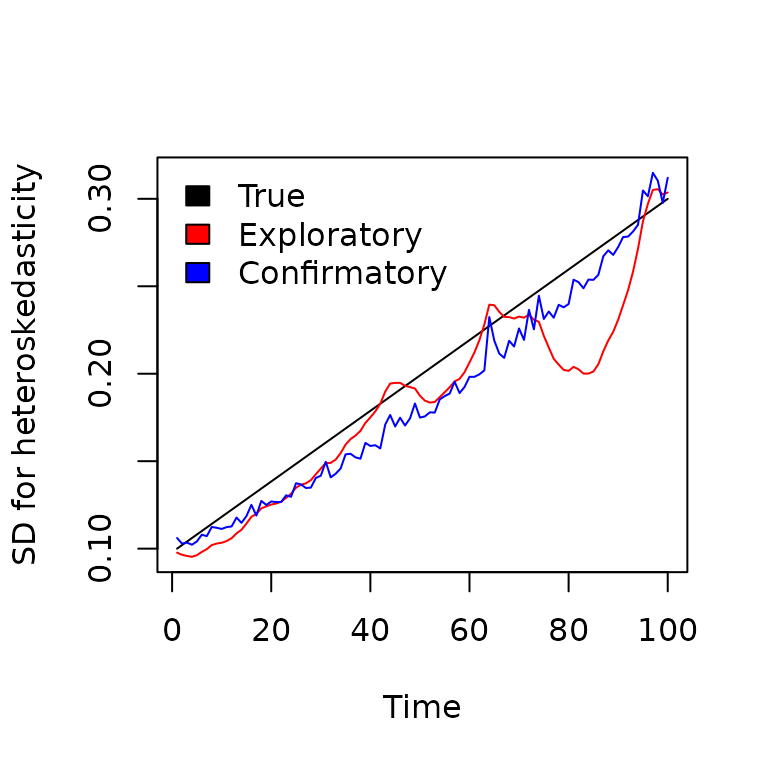

# MGARCH

## Multivariate Generalized Autoregressive Conditional Heteroskedasticity (MGARCH) models

`dsem` can be specified to estimate variation over time in a parameter
representing the magnitude of exogenous variance (i.e., two-headed
arrow). This essentially allows `dsem` to function as a Multivariate
Generalized Autoregressive Conditional Heteroskedasticity (MGARCH)
model, while allowing missing values for covariates that drive changes
in variance.

To show this, we simulate three time-series of $`T=100`$ length, with no
correlation but a steady increase in the standard deviation over time:

``` r

library(dsem)
set.seed(123)

# Specify settings
n_times = 100
n_vars = 3

# SD over time
sigF_t = seq( 0.1, 0.3, length = n_times )

# Simulate and apply time-varying SD
eps_tc = matrix( rnorm(n_times*n_vars), ncol = n_vars )
eps_tc = sweep( eps_tc, MARGIN = 1, FUN = "*", STAT = sigF_t )
```

## Exploratory MGARCH

We first fit this without any covariate. To do so, we specify a latent
variable `F` that follows a random walk with unit variance. This
variable the moderates the double-headed arrows (representing the
magnitude of exogenous variance) for each time-series:

``` r

# Define data including latent factor for heteroskedasticity
dat = data.frame(
  setNames( data.frame(eps_tc),letters[seq_len(n_vars)]),
  F = NA
)

# Define SEM using F as latent moderating variable
sem = "
  a <-> a, 0, F
  b <-> b, 0, F
  c <-> c, 0, F
  F <-> F, 0, sdF, 0.1
  F -> F, 1, NA, 1
"

# exploratory fit
fit1 = dsem(
  tsdata = ts(dat),
  sem = sem,
  estimate_mu = colnames(dat),
  control = dsem_control(
    use_REML = FALSE,
    gmrf_parameterization = "full",
    logscale_moderating_variance = TRUE,
    quiet = TRUE
  )
)

# Inspect estimates
summary(fit1)
#>      path lag name start parameter first second direction   Estimate Std_Error
#> 1 a <-> a   0    F    NA         0     a      a         4         NA        NA
#> 2 b <-> b   0    F    NA         0     b      b         4         NA        NA
#> 3 c <-> c   0    F    NA         0     c      c         4         NA        NA
#> 4 F <-> F   0  sdF   0.1         1     F      F         2 0.07221498 0.0252122
#> 5  F -> F   1 <NA>   1.0         0     F      F         1 1.00000000        NA
#>    z_value     p_value
#> 1       NA          NA
#> 2       NA          NA
#> 3       NA          NA
#> 4 2.864287 0.004179491
#> 5       NA          NA
```

The model has a nonzero estimate of `sdF` representing the variance over
time in heteroskedasticity (in log-space), suggesting that the model
detects the heteroskedasticity.

## Confirmatory MGARCH

Alternatively, we might specify a covariate that is hypothesized to
drive heteroskedasticity. In this case, we simply specify a trend over
time as covariate, and estimate its impact on the latent moderating
variable. To avoid confounding between the random-walk for the latent
variable and the trend covariate, we also remove the random-walk from
the latent factor. Finally, we randomly simulate missing data in the
covariate, to show that the MGARCH can still accomodate data that are
missing at random:

``` r

# Define data including latent factor for heteroskedasticity and covariate
dat = data.frame(
  setNames( data.frame(eps_tc),letters[seq_len(n_vars)]),
  F = NA,
  slope = scale( seq_len(n_times), center = TRUE, scale = TRUE )
)

# Randomly simulate 10% missing data for covariate
dat$slope[ sample(seq_len(n_times), n_times/2) ] = NA

# Define SEM using F as latent moderating variable
# and slope as covariate for F
sem = "
  a <-> a, 0, F
  b <-> b, 0, F
  c <-> c, 0, F
  F <-> F, 0, sdF, 0.1
  slope <-> slope, 0, sd_slope
  slope -> slope, 1, NA, 1
  slope -> F, 0, beta
"

# confirmatory MGARCH
fit2 = dsem(
  tsdata = ts(dat),
  sem = sem,
  estimate_mu = colnames(dat),
  control = dsem_control(
    use_REML = FALSE,
    gmrf_parameterization = "full",
    logscale_moderating_variance = TRUE,
    quiet = TRUE
  )
)

# Inspect estimates
summary(fit2)
#>              path lag     name start parameter first second direction
#> 1         a <-> a   0        F    NA         0     a      a         4
#> 2         b <-> b   0        F    NA         0     b      b         4
#> 3         c <-> c   0        F    NA         0     c      c         4
#> 4         F <-> F   0      sdF   0.1         1     F      F         2
#> 5 slope <-> slope   0 sd_slope    NA         2 slope  slope         2
#> 6  slope -> slope   1     <NA>   1.0         0 slope  slope         1
#> 7      slope -> F   0     beta    NA         3 slope      F         1
#>      Estimate   Std_Error     z_value      p_value
#> 1          NA          NA          NA           NA
#> 2          NA          NA          NA           NA
#> 3          NA          NA          NA           NA
#> 4  0.10617048 0.112550326   0.9433156 3.455195e-01
#> 5 -0.04800428 0.004794621 -10.0121119 1.348428e-23
#> 6  1.00000000          NA          NA           NA
#> 7  0.32588875 0.046440238   7.0173790 2.260688e-12
```

The model has a positive estimate of `beta`, indicating that it
attributes some portion of heteroskedasticity to the hypothesized
covariate.

## Comparison

We can then plot these estimated variances against the true (simulated)
value

``` r

# Bundle true and estimated time-series
Y = cbind(
  True = sigF_t,
  exp(predict(fit1)[,4]),
  exp(predict(fit2)[,4])
)

#
matplot( 
  x = seq_len(n_times), y = Y, type = "l", lty = "solid",
  col = c("black","red","blue"), xlab = "Time", 
  ylab = "SD for heteroskedasticity"
)
legend( "topleft", fill = c("black","red","blue"), bty = "n",
        legend = c("True", "Exploratory", "Confirmatory"))
```



As expected, using a covariate improves the estimated heteroskedasticity
even in the presence of missing data.

Runtime for this vignette: 3.41 secs
